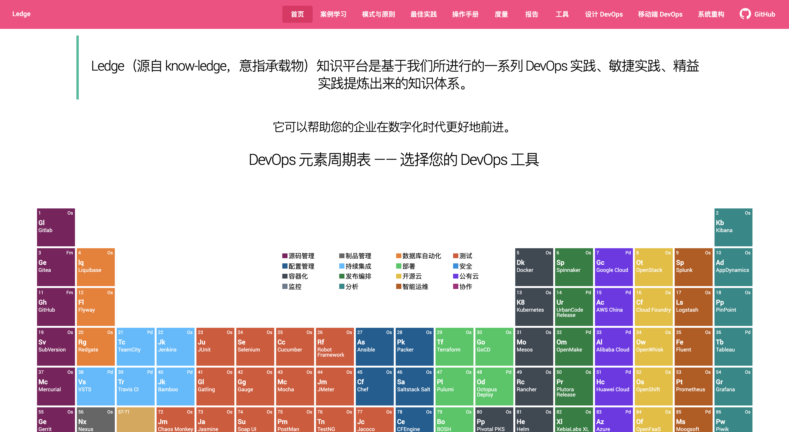

# Ledge 知识平台

Ledge （from Know-Ledge，意指承载物）知识平台是基于我们在 ThoughtWorks 进行的一系列 DevOps 实践、敏捷实践、精益实践提炼出来的知识体系。



您可以在这个平台上看到：

 - **工具元素周期表**。帮助您进行数字化时代的 DevOps 工具选型。
 - **DevOps 设计工具**。帮助您设计组织内的 DevOps 流程，涵盖了流程、人、工具、制品等等。
 - **案例学习**。从社区的知识库中，我们总结了传统企业走向 DevOps 的经验，并浓缩到易于使用的内容里。
 - **最佳实践**。我们从海量的 DevOps 内容里，提炼出了一系列的最佳实践，以更好地帮助企业进行 DevOps 实践。
 - **模式与原则**。基于我们的实践，我们提炼了位于它背后的模式与原则，帮助个人和组织更好地了解 DevOps 文化。
 - **操作手册**。只凭实践与原则，无法让中小型 IT 团队进行 DevOps 转型，所以我们准备了详实的操作手册，一步步前进。
 - **度量**。KPI - 度量、度量 - KPI、KPI - 度量，帮助您更好地度量 DevOps 转型情况。
 - **报告**。我们尝试从丰富地 DevOps 报告中，提炼出有用的实践和工具。
 - **相关资源**。尽管本平台已经提供了丰富的资源，但是我们相信更多的资源可以帮助您们学习背后的理念。

## Contribution

从互联网的海量知识提炼内容，并不是一件简单的事情。取其精华，去其糟粕，是我们一直在做的事情。

欢迎您在这个项目的 Issue 中留下您的宝贵意见，以帮助其他/她人更好地学习 DevOps 相关的知识。它可以是：

 - 修改手误的文本
 - 针对不合时宜内容的评论
 - 更好地 DevOps 实践
 - 缺失的内容引用
 - 相关的工具推荐
 - 成熟的 DevOps 平台
 - ……

您可以从这里修改内容：[src/assets/docs](src/assets/docs) 。

## Development

架构：

 - [文档代码化](https://devops.phodal.com/practise#docs-like-code)。我们采用了 Markdown like code 的理念，来生成一系列的内容和图表等。
 - 持续部署。基于 GitHub Pages 和  GitHub Actions，我们构建了一套自动化部署系统，提交即部署。
 - 微前端。我们通过 Web Components 来构建项目的微前端体系
 - WebComponents

### Setup

1. install

```
yarn install
```

2. run

```
yarn start
```

### Plugins 

 - https://github.com/phodal/devops-path
 - https://github.com/phodal/devops-periodic
 
### Markdown 扩展语法

通过语法高亮参数来扩展能力，如 

```
```process-step
 - 第一阶段闭环：开发测试融合
   - 看板 
   - 站会 
\`\`\`
```

 - echarts。直接渲染 Echarts 图表
 - mindmap。Markdown List 转为思维导图
 - radar。Markdown List 转为雷达图
 - process。流程
 - process-table。带流程的图表
 - process-step。带流程的图表 2
 - pyramid。金字塔图形
 - quadrant。四象限图
 - class。直接调用 CSS 的 class
 - graphviz。使用 Dot 渲染图片
 - mermaid。使用 mermaid 可视化
 - webcomponents。调用 WebComponents 组件

## Inspired by

Fluency

 - http://agilefluency.org/

Periodic

 - [https://stackblitz.com/edit/ng-periodic-table](https://stackblitz.com/edit/ng-periodic-table)
 - [https://www.nexthink.com/periodic-table/](https://www.nexthink.com/periodic-table/)

others see in the Code.

License
---

[](http://ideas.phodal.com/)

@ 2020 A [Phodal Huang](https://www.phodal.com)'s [Idea](http://github.com/phodal/ideas).  This code is distributed under the MPL license. See `LICENSE` in this directory.
