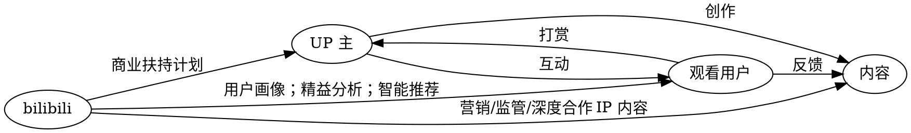

# Bilibili

来源：《[B 站持续交付案例分析]((https://mp.weixin.qq.com/s/XsaOYDCTpkq7QxW8z-xVCQ)》

> 全称为哔哩哔哩弹幕网，亦称哔哩哔哩、bilibili 弹幕网，或简称为 B 站。是中国大陆一个 ACG 相关的弹幕视频分享网站，其前身为视频分享网站 Mikufans

以 " 原创内容 + 用户 + 弹幕 " 的交互方式所构筑的强粘性社区生态环境



## 用户价值为导向的需求管理

### 用户画像

- 二次元用户：可以追番剧，了解二次元文化，希望认识更多同好
- UGC 创作者（核心目标用户）：希望有一个大平台可以让自己作品被看到，收到大家认同。
- 直播爱好者：希望有平台能展示自己的才能。
- 非二次元用户：只是单纯的希望能找到有序的视频，或跟随喜欢的 UP 主或主播而来

```quadrant
 - 模型
   - 视频内容类
     - 番剧、原创视频等功能
     - UP 主自动类视频功能
   - 氛围环境类
     - 弹幕和交流环境需求
     - 审核相关需求
   - 用户体验类
     - 页面布局类
     - 交互设计需求
   - 社区文化类
     - 会员制作相关需求
     - 支持圈层交流的需求

config: {"left": "运营数据分析", "right": "用户诉求转化", "bottom":"用户体验反馈", "top":"商业价值分解"}
```

优先级顺序：

1. 基于用户及商业价值的分析
2. 基于核心用户的诉求和用户画像
3. 优先考虑需求的迫切程度
4. 通过良好的用户体验既维持老用户的粘度
5. 系统运行稳定的一些非功能性（PS：跨功能性）的需求
6. 基于商业价值考量

开发方法（四象限法）：

- 四象限法。四象限法来进行需求的筛选和排序
- 开发难度和效果分析。通过需求的用户范围、发生频率和成本、效益，进行综合分析排序

### 运维

自研日志平台 Billions：

| 采集     | 传输   | 切分     | 检索         |
| -------- | ------ | -------- | ------------ |
| Filebeat | Flume  | Logstash | Kibana       |
|          | Kafaka |          | EasticSearch |

监控平台：Prometheus

> B 站基于联邦方式部署 Prometheus，并将采集到的指标远端存储至 Influxdb 中，关联 CMDB 获取监控对象，界面化配置告警规则，集中处理告警事件，形成高可用、扩展强、易用监控平台。

实时数据平台：

> B 站实时数据平台-saber，解决实时计算开发门槛高、作业管理难、无统一告警及工程开发师和算法工程师之间明确分工问题。saber 平台支持 BSQL 和 DAG 拖拽式编程，约束输入源 schema，规范输出源格式，降低 Flink 开发门槛；同时解决流式 Join、维表 Join 和实时特征等数据处理过程中状态、Timer、sq l 扩展等难点，让工程无缝对接 AI 平台。
