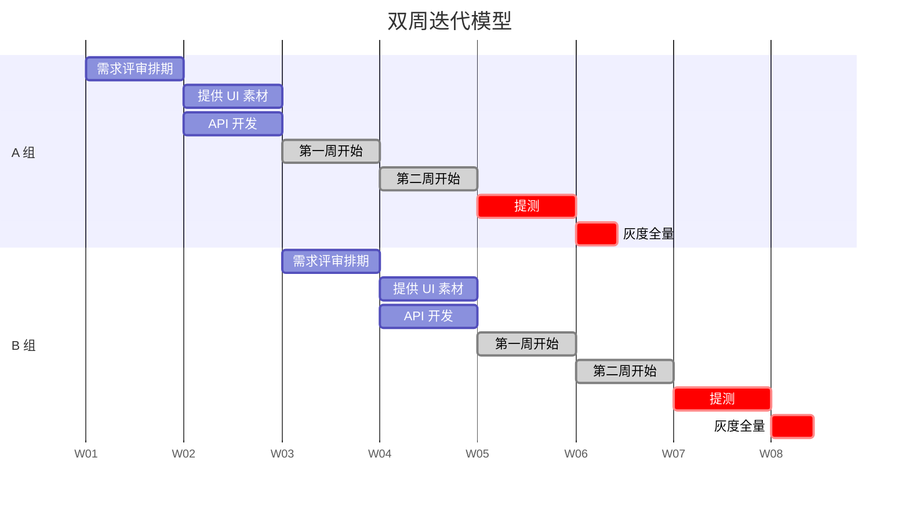

# 美团

## 美团外卖

来源：[美团外卖持续交付的前世今生](https://tech.meituan.com/2020/02/13/meituan-waimai-continuous-delivery.html)

### 双周迭代模型



### 自动化版本管理系统

#### 人工操作事件

```process-step
 - 开发阶段
   - 创建外卖新版本分支
   - 版本降级检查
   - 全源码检查
   - 每日包号周知
   - 周迭代提测
   - 包大小统计
   - 迭代包提测
   - 一轮提测
   - 提测邮件
 - 一轮提测
   - 每日包号提测
   - 全源码检查
   - 仓库拉出 release 分支
   - UI 走查提醒
   - 二轮提测
   - 提测邮件
 - 二轮提测
   - 每日包号提测
   - 全源码检查
   - 三轮提测
   - 提测邮件
 - 三轮提测
   - 每日包号提测
   - 仓库 relase 分支合并
   - 仓库集成到团 release
   - 基础库同步到下版本
   - 代码集成提醒
 - 灰度阶段
   - 版本人力统计
 - 全量阶段
   - 全量上线周知
```

### 持续集成建设

```mindmap
 - CI 建设
  - 开发阶段准备
    - 拉 Aimeituan 工程的开发分支
    - 修改开发分支版本号
    - Aimeituan 工程独立编译自动配置
  - PR 检测
    - 静态检测
    - 增量检测
      - SDK
      - 包大小
    - 单测
  - 开发阶段
    - 定时检测壳工程是否有更新，触发自动打包
    - 每日最新版本号提醒
  - 提测阶段
    - 冒烟提醒
    - 自动拉提测分支
    - 业务库检测是否有 PR 未合入
    - 提测打包、发提测邮件
  - 发版阶段
    - 分支合并
    - 外卖业务库合入 Aimeituan 提测分支
    - 全量提醒
```

## 美团点评

来源：《[美团点评研发过程度量平台建设实践](https://www.infoq.cn/article/GdNArpHyZkZmuilgLRmd)》

### 质量度量

#### 线上质量

```process-card
| 服务端 |移动端|
|-|-|
| 流量 | 可靠性 |
| 故障/缺陷 | 性能效率 |
| 性能 | 兼容性 |
| 饱和度 | 易用性 |
| 线上告警 | 可维护性 |
| | 安全性 |

config: {"colors": [{"bg":"#e55852","font":"#b71a09"},{"bg":"#e98832","font":"#c85113"},{"bg":"#f0d668","font":"#b88d0f"}]}
```

#### 过程质量

```process-card
| 需求质量 | 代码质量 | 测试质量 | 发布质量 |
|-|-|-|-|
| 需求 Bug 数 | 圈复杂度 | 测试覆盖率 | 发布成功率 |
| 需求打回次数 | 类内聚度 | 漏测率    | 发布回滚率 |
| | 构建成功率 | CI 拦截问题 | 发布失败恢复时长  |
| | 千行代码 bug 率 | 缺陷分析 | |
| | 提测打回率   | 自动化覆盖率 | |
| | RP decline 率| | |

config: {"colors": [{"bg":"#e55852","font":"#b71a09"},{"bg":"#e98832","font":"#c85113"},{"bg":"#f0d668","font":"#b88d0f"},{"bg":"#a4c9cf","font":"#598893"}]}
```

## 测试

### APP

相关资源：

- 《[美团点评云真机平台实践](https://tech.meituan.com/2018/07/19/cloud-phone.html)》
- 《[客户端自动化测试研究](https://tech.meituan.com/2017/06/23/mobile-app-automation.html)》

框架选型：Appium + Cucumber

### API 测试平台

相关资源：

- 《[Lego-美团接口自动化测试实践](https://tech.meituan.com/2018/01/09/lego-api-test.html)》

常见失败原因：

| 被测系统出错 | 测试工具出错    | 测试数据错误             | 不可抗力 |
| ------------ | --------------- | ------------------------ | -------- |
| 服务缺陷     | 测试平台出错    | 数据写错                 | 机房变动 |
| 服务功能变动 | 数据库连接出错  | 数据失效                 | 断电断网 |
| 环境配置问题 | 依赖的方法异常  | 服务 IP 变更             | 网络异常 |
|              | 用例 / 框架问题 | 接口功能变动，用例未更新 | 空调坏了 |
