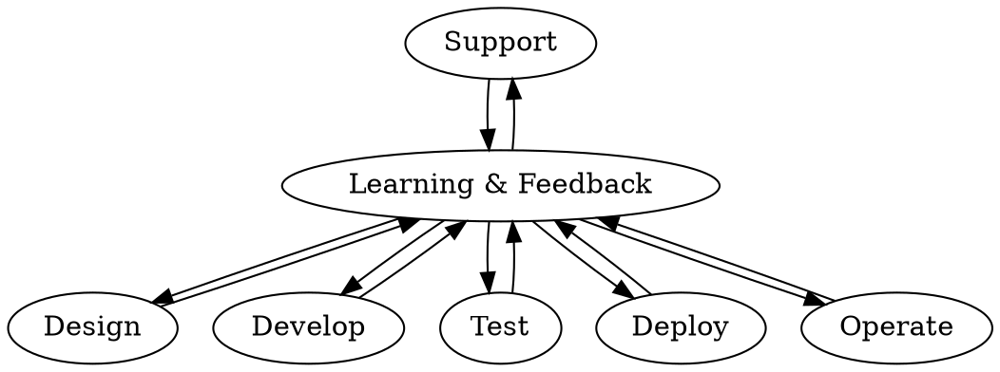

## Netflix

来源：《[Full Cycle Developers at Netflix — Operate What You Build](https://netflixtechblog.com/full-cycle-developers-at-netflix-a08c31f83249)》

### SDLC（软件开发生命周期）

软件开发生命周期：

```process-table
| Design | Develop | Test | Deploy | Operate | Support
|-|-|-|-|-|-|
```

对应的专家：

```process-table
| Design | Develop | Test | Deploy | Operate | Support
|-|-|-|-|-|-|
| Architect | Developer | SDET | Release Eng | Sys Admin | Customer Support |
```

DevOps 原则：



- 通过开发者工具进行伸缩：[https://netflix.github.io/](https://netflix.github.io/))
- 全生命周期开发人员
- 权衡取舍

### Windows

来源：《[Applying Netflix DevOps Patterns to Windows](https://netflixtechblog.com/applying-netflix-devops-patterns-to-windows-2a57f2dbbf79)》
