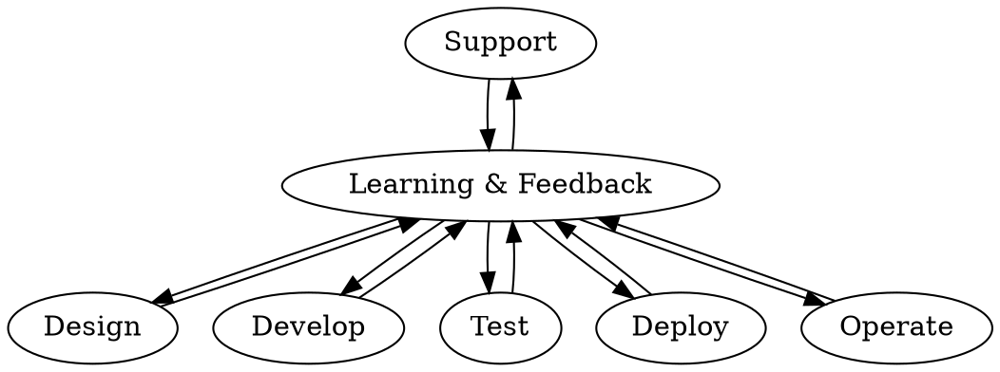

## Netflix

### 构建

来源：《[How We Build Code at Netflix](https://netflixtechblog.com/how-we-build-code-at-netflix-c5d9bd727f15)》

| 代码检入                    | 持续集成                    | Bake                        | 部署      | 预部署测试 | 热修复    | 金丝雀    | 上线      |
| --------------------------- | --------------------------- | --------------------------- | --------- | ---------- | --------- | --------- | --------- |
|                             |                             | Spinnaker                   | Spinnaker | Spinnaker  | Spinnaker | Spinnaker | Spinnaker |
| Git，Nebula，Jenkins，Baker | Git，Nebula，Jenkins，Baker | Git，Nebula，Jenkins，Baker |

> Spinnaker 是一个免费的开源持续交付软件平台，最初由 Netflix 开发，并很快被 Google 接受和扩展。它旨在与 Kubernetes，Google Cloud Platform，AWS，Microsoft Azure 和 Oracle Cloud 配合使用，并支持社区定期添加的更多平台。

进入持续集成之前：

- 代码在本地使用 [Nebula](https://nebula-plugins.github.io/) 构建和测试
- 修改提交到一个中心化的 Git 代码库
- 一个 Jenkins 任务将执行 Nebula
- 构建『baked』到 AMI
- Spinnaker 流水线用来部署和促进代码变更

### 全生命周期开发者

来源：《[Full Cycle Developers at Netflix — Operate What You Build](https://netflixtechblog.com/full-cycle-developers-at-netflix-a08c31f83249)》

软件开发生命周期：

```process-table
| Design | Develop | Test | Deploy | Operate | Support
|-|-|-|-|-|-|
```

对应的专家：

```process-table
| Design | Develop | Test | Deploy | Operate | Support
|-|-|-|-|-|-|
| Architect | Developer | SDET | Release Eng | Sys Admin | Customer Support |
```

DevOps 原则：



- 通过开发者工具进行伸缩：[https://netflix.github.io/](https://netflix.github.io/))
- 全生命周期开发人员
- 权衡取舍

### Windows 下的 DevOps 模式

来源：《[Applying Netflix DevOps Patterns to Windows](https://netflixtechblog.com/applying-netflix-devops-patterns-to-windows-2a57f2dbbf79)》

TBD
