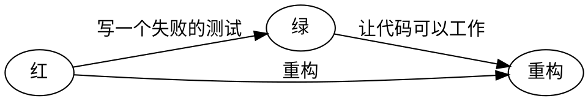

# Ledge 语法帮助

```kanban
 - Kanban Name
     - Todo
       - done basic feature
       - write document
     - Doing
       - create componet
       - add testing
     - Done
       - create card
```

```tech-radar
 - 框架
   - adopt
     - Angular
     - D3.js
   - trail
     - Echarts
   - assess
     - Stencil.js
     - Ionic
   - hold
     - react
 - 平台
   - adopt
     - GitHub
   - trail
   - assess
   - hold
 - 语言
   - adopt
     - TypeScript
   - trail
   - assess
   - hold
     - JavaScript
 - 技术
   - adopt
   - trail
     - Web Components
   - assess
   - hold
```

```list-style
 - 开源工具采用
 - 商业采购
 - 自研研发交通平台

config: {"type": "circle"}
```

```list-style
 - 基于开源方案遇到困难
   - 性能瓶颈
   - 业务需求⽇益多元化，但团队规模有限
 - 扩展更多的能力
   - 更多元化的代码质量检查
   - 审计需求
   - 二进制、镜像安全扫描

config: {"type": "group-square"}
```

```echarts
{
"series": [
    {
        "type": "treemap",
        "breadcrumb": {"show": false},
        "roam": "move",
        "data": [{
            "name": "nodeA","value": 10,
            "children": [
              {"name": "HealthController.java", "value": 4 },
              {"name": "HealthService.java", "value": 6}
            ]},
            {"name": "HealthModel.java", "value": 20}
        ]
    }
]
}
```



```toolset
 - 用户体验
 - 时间
 - 成本
 - 安全
 - 范围

config: {"type": "slider"}
```

```toolset
|  Challenge;Skill/Ability   | low | high |
|-|-|-|
| low  |      | boredom |
| high | anxiety | flow |

config: {"type": "line-chart"}
```

```quadrant
 - 技术债墙
     - 快速解决
       - ……
       - ……
       - ……
     - 分解并计划
       - ……
       - ……
       - ……
     - 在可能的时候提升
       - ……
       - ……
     - 暂时不管
       - ……
       - ……
       - ……

config: {"left": "简单", "right": "困难", "bottom": "不重要", "top": "重要"}
```

```radar
 - 质量属性网络
   - 可靠性
   - 可修改性
   - 安全性
   - 可测试性
   - 性能
   - 可用性
```

```radar
 - 质量成熟度评估模型
  - 质量内建: 3 -> 4
  - 优化业务价值: 2 -> 2
  - 质量统一，可视化: 1 -> 5
  - 全员参与: 3 -> 4
  - 快速交付: 4 -> 5
  - 测试作为资产: 2 -> 3
  - 快速反馈: 5 -> 5

config: {"legend": ["当前", "未来"]}
```

```pyramid
 - 寻找价值
   - 价值：、
   - 质量：零缺陷、设计良好
   - 划分：小、完整
   - 构建：价值优先、逐渐完善产品
   - 计划：持续、接下来做什么？
   - 组织：团队、人员与技能
   - 指导：何物、何时
```

```mindmap
 - CI 建设
  - 开发阶段准备
    - 拉 Aimeituan 工程的开发分支
    - 修改开发分支版本号
    - Aimeituan 工程独立编译自动配置
  - PR 检测
    - 静态检测
    - 增量检测
      - SDK
      - 包大小
    - 单测
  - 开发阶段
    - 定时检测壳工程是否有更新，触发自动打包
    - 每日最新版本号提醒
  - 提测阶段
    - 冒烟提醒
    - 自动拉提测分支
    - 业务库检测是否有 PR 未合入
    - 提测打包、发提测邮件
  - 发版阶段
    - 分支合并
    - 外卖业务库合入 Aimeituan 提测分支
    - 全量提醒
```

```process-step
 - 平台层
   - 运维平台
   - 小米私有云
   - 小米生态云
 - 能力层
   - 团队注册
   - 一键接入
   - 检测扫描工具集成
   - 发布部署
   - 标准化工具接入
 - 工具层
   - Gitlab
   - Phabricator
   - Jenkins on K8s
   - 代码质量扫描
   - 安全/法律合规扫描
   - 二进制&产出物存储
   - 二进制安全扫描
   - 二进制法务审计扫描
   - 部署服务
 - 数据层
   - 数据智能应用
   - 研发效能数据仓库
```

```javascript
console.log('hello, world');
```

|     | normal | table |
| --- | ------ | ----- |
|     |        |       |
|     |        |       |

```process-table
| 源码管理 | 代码质量 | 制品管理  | 测试 | 持续集成 | 分析 | 协作  |
|-|-|-|-|-|-|-|
| Git | TSLint | Git (history) | Jasmine | GitHub Action | GitHub Traffic | GitHub Projects |
| GitHub | Code Climate | |  Jest | | Google Analysis |  |
```

### 采用 DevOps 的行业

```chart
| 行业 | 占比 |
|-|-|
| 技术 | 38% |
| 金融服务 | 12% |
| 零售/消费/电子商务 | 9% |
| 其它 | 9% |
| 医疗保健和制药 | 5％ |
| 政府 | 5% |
| 媒体/娱乐 | 4% |
| 保险 | 4% |
| 教育 | 4% |
| 工业和制造业 | 4% |
| 电信 | 3% |
| 能源 | 3% |
| 非营利 | 1% |
```

## 组织所使用的操作系统

```chart
| 操作系统  |  2018 | 2019 |
|-|-|-|
| Windows 2003/2003R2 | 12% | 6% |
| Windows 2008/2008R2 | 33% | 26% |
| Windows 2012/2012R2 | 56% | 52% |
| Other Windows      | 22% | 25% |
| Linux Debian/Ubuntu variants  | 36% | 43% |
| Linux Enterprise variants (RHEL, Oracle, CentOS) | 48% | 49% |
| Linux Fedora        | 5% | 4% |
| SUSE Linux Enterprise Server  | 8% | 5% |
| Linux OpenSUSE | 4% | 4% |
| Linux Arch    | 2% | 2% |
| Other Linux  |  13% | 11% |
| Other UNIX  | 8% | 4% |
| FreeBSD/NetBSD/OpenBSD   | 3% | 3% |
| AIX                | 10% | 7% |
| Solaris OS         | 12% | 5% |
| Other              | 12% | 8% |

config: {"type": "bar", "multiset": true}
```

```step-line
 - 源码管理
 - 制品管理
 - 配置管理
 - 数据库自动化
 - 测试
 - 持续集成
 - 监控
 - 分析
 - 智能运维
 - 协作
```

- list
- item

> spliqt

- a
  - a
    - a
    - b

这是一个正常无比的段落。

> blockquote

## [Link in Heading](https://devops.phodal.com/design)

<a href="https://www.phodal.com/">phodal.com</a>

---

1. fsda
2. 34 sdf

- a
- a

3. sdaf

b

- [ ] a
- [ ] b
  - [ ] c

```pie
 - Some & title
   - a: 4
   - b: 12
   - c: 21
   - d: 19
```
