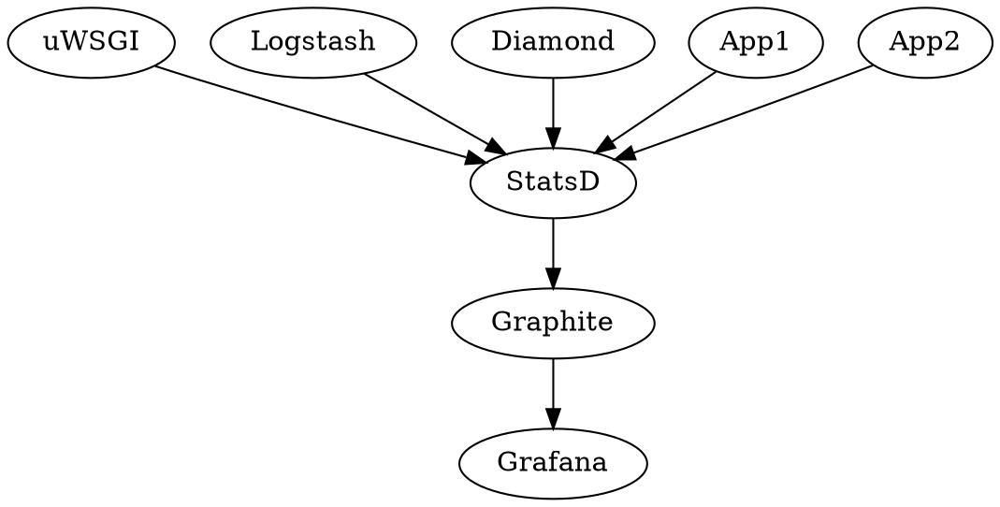
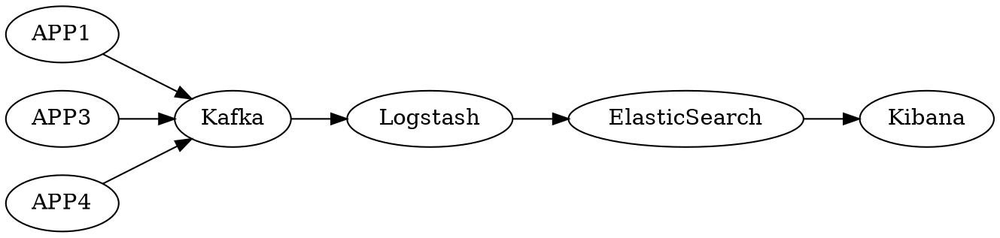

# 总览

**免责声明**：本操作手册并非适用于所有的企业，也并非所有的组织都应当按照该流程实施。 —— Phodal

我们依据我们的实施经验将 DevOps 实施的过程分为了这么几个步骤：

1. [建立愿景与方向](/manual#建立愿景与方向)
2. [度量：组织、系统现状](/manual#度量)
3. [准入条件](/manual#准入条件)。查看是否满足实施 DevOps 的准入条件。
4. [探索可行方案](/manual#探索可行方案)。即 MVP 尝试
5. [MVP](/manual#mvp)。一次快速的 DevOps 过程和结果的 showcase。
6. [精细的 DevOps 实施](/manual#实施落地)
7. [回顾优化](/manual#回顾优化)
8. [规模化 DevOps 落地](/manual#规模化)

对应的在手册中，还包含了

- 附录 1：移动应用的自动化测试
- 附录 2：可信软件系统 10 要素
- 附录 3：基本概念

# 建立愿景与方向

## 业务关注点

| 组成部分标题 | 内容                                                               |
| ------------ | ------------------------------------------------------------------ |
| 问题         | 为什么对组织来说引入 DevOps 实践是有好处的？                       |
| 成本         | 引入 DevOps 实践的预期成本是什么？                                 |
| 干系人影响   | 对内部和外部干系人的影响是什么？                                   |
| 风险和缓解   | 与引入 DevOps 实践相关联的组织和技术风险是什么？如何减缓这些风险？ |
| 推出计划     | 推出 DevOps 的实践计划是什么？                                     |
| 成功标准     | 我们如何知道 DevOps 实践的引入是成功的 ？                          |

—— 《DevOps 架构师行动指南》

## 识别目标和现状

### 自评

### 差距分析

### 确认团队

优先选择优秀的团队？

### 设立里程碑

时间节点-团队-活动-产出表

## 落地策略

### DevOps 转型策略

在 Google ACCELERATE State of DevOps 2019 中有一个基于性能侧的 DevOps 转型策略热图（HEATMAP OF DEVOPS TRANSFORMATION STRATEGIES BY PERFORMANCE PROFILE）

```heatmap
| 类型                     | 低  | 中  | 高  | 精英 |
| ------------------------ | --- | --- | --- | ---- |
| 训练中心（DOJO）            | 27% | 21% | 18% | 14%  |
| 卓越中心                 | 34% | 34% | 20% | 24%  |
| 只有概念证明，没有下一步 | 41% | 32% | 20% | 16%  |
| 把概念证明当种子         | 16% | 29% | 29% | 30%  |
| 把概念证明当模板         | 21% | 24% | 29% | 30%  |
| 实践社区                 | 24% | 51% | 47% | 57%  |
| 大爆炸式改革             | 19% | 19% | 11% | 9%   |
| 由下而上，或者基层导入   | 29% | 39% | 46% | 46%  |
| 混搭                     | 46% | 42% | 34% | 38%  |
```

### 自行落地

#### 1. 组织层级解决跨团队协作

#### 2. 建立 DevOps 知识库

顺带一提，Ledge 已经成为了多个 DevOps 公司的内部资料库的外部参考资源。

#### 3. 培养内部专职教练

### 供应商

#### 1. 避免供应商锁定

> 供应商锁定通常被定义为“专利锁定或客户锁定，这使得客户依赖于供应商的产品和服务，无法在不产生大量切换成本的情况下使用其他供应商。

#### 2. 培养内部能力

### 外部教练

#### 1. 结对模式

#### 2. 赋能团队

#### 3. 内部总结分享

### 咨询公司

咨询公司能从行业内的视野，提供相关的案例，给出更好的建议。

## 可视化现状和未来

### Path to Production

Path to Production，来源于精益，旨在通过可视化的方式来展示项目的上线流程，并优化过程中的瓶颈问题。它类似于我们使用 CI（持续集成）时的 Pipeline。传统的 Pipeline 的 gate 可以通过代码定义一些标准，由测试不能挂，测试覆盖率不能低于多少，打包不能失败等等。而这些 Pipeline 则是分别由开发人员、测试人员、运维人员、项目负责人等等来负责把控的。

对应的，在这个过程中：流程（Process）、人（People）、工具（Tooling）、产物（Artifacts） 都是我们的关注点：

- Process，即上线需要多少流程。从提交代码开始，运行持续集成，部署到 Dev 环境等等。
- People，即过程中需要哪些人来参与。如需要开发人员提交代码，需要测试人员进行 QA 环境部署，需要项目经理等高级领导进行上线审批等。
- Tooling，即需要使用哪些工具来完成上线。如托管代码的 Git 服务器，运行构建的持续集成工具，提交上线申请的相关工具等等。
- Artifacts，即过程中产出的产物。如生成的应用包，QA 生成的测试报告等等。

随后，我们从相关的流程中，梳理出每个部分（流程）的持续时间、痛点，来查找优化空间。

《[如何优化上线流程——Path to Production](https://www.phodal.com/blog/tech-lead-tools-path-to-production/)》

示例：

| 活动 | stage 1      | stage 1      | stage 1         | stage 1       | stage 1  | stage 1       | stage 1  | stage 1  | stage 1 |
| ---- | ------------ | ------------ | --------------- | ------------- | -------- | ------------- | -------- | -------- | ------- |
| 流程 | 提交代码     | 运行 CI      | 部署到 Dev 环境 | 运行 E2E 测试 | 手动测试 | 部署到 ST/UAT | 手动测试 | 上线申请 | 上线    |
| 人   | Dev          | Dev          | Dev             | Dev           | Dev      | 项目 QA       | 业务 QA  | 业务 QA  | PM      | Dev |
| 工具 | Git & GitHub | Jenkins      | Jenkins         | Jenkins       | -        | Jenkins       | -        | 邮件     | -       |
| 制品 | 代码         | 持续集成结果 | -               | 测试报告      | 测试报告 | -             | 邮件结果 | -        |         |

### Path to DevOps

| 源码管理 | 制品管理 | 配置管理 | 数据库自动化 | 测试 | 持续集成 | 监控 | 分析 | 智能运维 | 协作 |
| -------- | -------- | -------- | ------------ | ---- | -------- | ---- | ---- | -------- | ---- |
| ---      | ---      | ---      | ---          | ---  | ---      | ---  | ---  | ---      | ---  |

## 确认 DevOps 流程

DevOps 流程


- 规划
- 编码
- 构建
- 测试
- 发布
- 部署
- 运维
- 监控

DevOps 框架

—— 出自《DevOps 最佳实践》


- DevOps 持续测试。
- DevOps 敏捷开发。
- DevOps 持续集成。
- DevOps 持续交付。
- DevOps 持续监控。
- DevOps 敏捷流程。

# 度量

《持续交付 2.0》中提到了一种不错的软件产品的交付效能度量方式：

```mindmap
 - 软件产品的交付效能
   - 速度
     - 需求响应能力
        - Feature Lead Time（业务需求前置周期）
        - User Story Delivery Time（用户故事交付周期）
     - 持续发布能力
        - Integration Testing Time（集成测试周期）
        - Release Frequency Time（发布频率）
        - MTT（X)（X 的平时时长，X = 发布 | 升级 | 缓解 | 解决）
   - 质量
     - 发布前质量
        - Remain Bugs（单位周期的遗留缺陷数）
        - Bugs/User Story（单个用户故事发现的缺陷数）
     - 发布后质量
        - Change Failure Rate（变更失败率）
        - Issues（单位时间内的生产环境故障数）
   - 价值
     - 需求吞吐量
        - Total Features（单位时间内交付的业务需求数）
     - 交付有效性
        - Success Rate（业务需求的成功率）
```

## 度量系统

### 度量软件发布

简单来说就，就是我们应该从软件的发布模型，倒推出软件的分支策略

#### 2B 模式

2B 型软件，采用多分支是难以避免的：

- 市场/客户驱动定制。如果一切的原则是为了生存下去，那么这一点难以避免。特别是那些生命周期长的行业应用来说，更是如此。
- 销售驱动开发。

常见的情况是，一个十来个人的团队，一年可能要交付至少 20 个项目。更不用说在电信行业中，需要针对于不同的国家或地区进行定制。

#### 2C 模式

2C 型软件，采用主干开发更有优势。

### 度量构建

是否拥有构建？

统计：

- 失败次数。
- 失败原因。常见：环境问题、专业度问题
- 构建时间。
- 构建流程。
- 如何管理依赖。

### 代码覆盖率

- Java
  - [Cobertura](http://cobertura.github.io/cobertura/)
  - [Jacoco](https://www.eclemma.org/jacoco/)
  - [Atlassian Clover](https://www.atlassian.com/software/clover)
- JavaScript
  - [Istanbul](https://istanbul.js.org/)
  - [Jest](https://jestjs.io/)
  - [Mocha](https://mochajs.org)
  - [Vue Test Utils](https://vue-test-utils.vuejs.org)
- Go

### 自动化性能测试

- [JMeter](https://jmeter.apache.org/)

### 代码质量分析工具

- Java
  - [CheckStyle](https://checkstyle.org/)
  - [PMD/CPD](https://pmd.github.io/)
  - [FindBugs](http://findbugs.sourceforge.net/)
- Groovy
  - [CodeNarc](https://codenarc.github.io/CodeNarc/)
- JavaScript / TypeScript
  - [Codelyzer](http://codelyzer.com/)
  - [ESLint](https://eslint.org/)
- 通用
  - [Sonar](https://www.sonarqube.org/)

## 度量团队和组织

### 团队组成和能力水平

### 团队的多样性

## 技术债务评估

> 对于技术债务，它的利息表现为系统的不稳定性，以及由于临时性手段和缺乏合适的设计、文档工作和测试带来的不断攀升的维护成本。 —— 《架构师应该知道的 97 件事》

如 Robert Nord 提出的 “技术债务全景图”（Tech Debt Landscape） 所示：


技术债对于软件的影响：可维护性（Maintainability）、可演进性（Evolvability），而这些技术债对于非技术人员来说都是不可见的。它们源于生活，藏于黑暗中。

### 技术债务收集

#### 技术债头脑风暴

1. 团队一起列出潜在的技术债
2. 归纳、分类技术债
3. 优先级排序
4. 物理板可视化

#### 开发时

来源：《[技术债务墙：让技术债务无所遁形](https://www.infoq.cn/article/59AylUvbtj5oWZbE7AaJ))》

在开发代码时你要想想：

- 是什么让你的速度变慢了？是什么让代码变得难以理解？是什么原因导致 bug 难以跟踪？什么东西应该被更好地记录下来或测试？在便利贴上记下你碰到的任何一个技术债务。保持简短，但要确保你以后仍然看得懂。
- 估计机会成本：如果不存在这个问题，你原本有多少时间可以用在其他事情上？把它写在便利贴上。确定好时间标记，例如用点号表示半天。视觉化比是否精确更重要。
- 估计解决这个技术债务需要多长时间，把它记下来。
- 或者记下如何解决技术债务。你可能会把它记在问题跟踪系统中，那么就把问题编号写在便利贴上。
- 把便利贴贴在技术债务墙上。
- 如果有人遇到同样的问题，添加更多的标记，用来表示他们付出的时间成本。

### 可视化

#### 技术债看板

```kanban
 - 技术债看板
   - Todo
     -  Lodash 体积过大
   - Doing
   - Done
     - Jasmine -> Jest
```

#### 技术债热力图

服务级别热力图


代码热力图？

```echarts
{
"series": [
    {
        "type": "treemap",
        "breadcrumb": {"show": false},
        "roam": "false",
        "nodeClick": "false",
        "data": [{
            "name": "nodeA","value": 10,
            "children": [
              {"name": "HealthController.java", "value": 4 },
              {"name": "HealthService.java", "value": 6}
            ]},
            {"name": "HealthModel.java", "value": 20}
        ]
    }
]
}
```

#### 技术债墙

```quadrant
 - 技术债墙
     - 快速解决
       - ……
       - ……
       - ……
     - 分解并计划
       - ……
       - ……
       - ……
     - 在可能的时候提升
       - ……
       - ……
     - 暂时不管
       - ……
       - ……
       - ……

config: {"left": "简单", "right": "困难", "bottom": "不重要", "top": "重要"}
```

### 技术债务评估

相关文章：

- 《[Defects 的启示](https://insights.thoughtworks.cn/about-defects/)》

# 准入条件

## 有意愿的组织

## 有意愿的团队

### 团队发展阶段模型

Bruck Tuckman 团队发展模型：

- 组建期
- 激荡期
- 规范期
- 执行期
- 休整期

守 -> 破 -> 离

```process-step
 - 组建期和激荡期：建立信任
   - 搞定问题的能力
   - 积极主动的态度
   - 团队合作的意识
 - 规范期和执行期：关注价值流程
   - "拉动"
 - 执行期：仪式感
   - ''
```

—— 来自《深入核心的敏捷开发》

## 有意愿、能力的个人

### DevOps 外部教练

### DevOps 内部教练

## 组织提供支持

## DevOps 实施看板

### 可视化现状

```kanban
 - DevOps 实施看板
   - Todo
     - 可视化后端测试覆盖率
   - Doing
     - 引入后端测试框架
     - 引入前端测试框架
   - Done
     - 制定测试实施计划
     - 制定测试策略
```

# 探索可行方案

## 可构建

不可构建的系统？

### 分解构建过程

——《Java 持续交付》

常规构建步骤：

- 校验。校验项目是否正确，并且所有的必要信息是否都存在？
- 编译。编译项目的源代码
- 测试。使用合适的单元测试框架中来测试编译后的源代码
- 打包。将已编译的代码打包为可分发的版本
- 确认。检查集成测试的运行结果，确保系统满足质量标准
- 安装。将软件包安装到本地仓库中，以便在本地环境中用作其他项目的依赖项
- 部署。在构建环境中完成部署，将最终的打包制品复制到远程仓库，以便与其他开发人员和项目共享。

### 遗留系统问题

9 种遗留系统现代化的技术

| 发生变化的方面 | Retain | Retire | Encapsulation | Rehost | Replatform | Refactor | Rearchitecture | Rebuild | Repuchase |
| -------------- | ------ | ------ | ------------- | ------ | ---------- | -------- | -------------- | ------- | --------- |
| 产品功能       | No     | No     | No            | No     | No         | Yes      | No             | Yes     | Yes       |
| 架构           | No     | No     | Yes           | No     | Yes        | No       | Yes            | Yes     | Yes       |
| 基础设施       | No     | No     | No            | Yes    | Yes        | No       | Yes            | Yes     | Yes       |
| 代码           | No     | No     | No            | No     | Yes        | No       | Yes            | Yes     | Yes       |

出处：《[Legacy System Modernization: How to Transform the Enterprise for Digital Future](https://www.altexsoft.com/whitepapers/legacy-system-modernization-how-to-transform-the-enterprise-for-digital-future/)》

## 可测试

选择测试框架并不是算太困难，只是我们需要知道是否需要：测试即文档。

### 测试策略

#### 测试策略工具

常见的测试策略组合：

- 框架/模式库测试。xUnit，xMock，如 Java 语言里的 JUnit, Mockito；JavaScript 中的 Jest
- 端到端 API 测试。JMeter，Postman，Rest Assured，Karate
- UI 集成测试。Protractor

考虑到测试即文档，在实现实现的时候，会配合一些支持自然语言描述的框架，如：

- 文档式测试，Gauge （主流语言），Concordion（Java）
- BDD 测试，Cucumber（主流语言）
- ATDD 测试，Robot Framework（Python 语言）

为了与运行客户端一配合，我们还需要有底层 API 来控制浏览器、客户端应用：

- Appium。移动 APP 和桌面应用，支持主流语言
- Selenium。Web 浏览器，支持主流语言
- Puppeteer。Node.js API 操作 Chrome 浏览器

### 遗留代码

如我在《[系统重构与迁移指南](https://migration.ink/)》一书中指出，要给遗留系统项目加测试并不是一件容易的事情。你需要找到对应年代的测试框架，熟悉对应年代的技术栈，然后才能一点点切入系统。

而后，当你遇到诸如 Java 中的 static 方法调用链时，你会发现难以继续往下，便得想着办法重构。而因为没有测试，你又没有办法重构。

#### 重构没有测试，测试加不了？

## 持续集成阶段设计

实施过程步骤：

- 流水线 hello, world
- 构建和部署流程自动化
- 单元测试自动化
- 集成现有代码分析服务
- 验收测试自动化
- 发布自动化

### 普通流水线模型

来自《持续交付 2.0》的示例：

GoCD 示例：

```pipeline
 - 提交构建
   - 编译打包:success
   - 代码扫描:success
   - 单元测试:success
   - 集成测试:success
 - 次级构建
   - 次级构建:success
   - 端到端测试:success
 - 部署到 UAT 环境
   - 部署到 UAT 环境:success
   - UAT 部署:success
 - UAT 结果
   - UAT 结果:success
   - 标记版本:success
 - 性能测试
   - 性能测试:success
 - 内部体验
   - 内部体验:success
   - 上传版本:success
 - 外部体验
   - 外部体验:success
   - 上传版本:success
 - 上传发布
   - 上传发布:success
```

```pipeline
 - 提交阶段
   - 提交阶段:success
   - 编译:success
   - 单元测试:success
   - 检查分析:success
 - 自动化验收测试
   - 自动化验收测试:success
 - 自动化容量测试
   - 自动化容量测试:success
 - 手工测试
   - 手工测试:success
   - 演示:success
   - 探索性测试:success
 - 发布
   - 发布:success
```

### 双流水线模型

CI + CD 分离

#### 持续集成

```pipeline
 - 代码检出
   - 代码检出:success
 - 安装依赖
   - 安装依赖:success
 - 构建
   - Lint:success
   - Build:success
 - 测试
   - 单元测试:success
 - 上传结果
   - 上传测试覆盖率:success
   - 上传构建结果:success
```

#### 持续交付

```pipeline
 - 代码检出
   - 代码检出:success
 - 安装依赖
   - 安装依赖:success
 - 构建
   - 构建:success
 - 构建服务端渲染
   - 构建服务端渲染:success
 - 部署
   - 部署:success
```

### 多流水线模型

#### 开源模式

#### PR 流水线

PS：针对于外部开源请求代码

```pipeline
 - 代码检出
   - 代码检出:success
 - 安装依赖
   - 安装依赖:success
 - 构建
   - Lint:success
   - Build:success
 - 测试
   - 单元测试:success
```

## 技术实践设计

### 提交规范

#### 提交信息规范

#### 预本地提交

#### 预服务器提交

### 制定代码规范

#### Checkstyle

#### Lint

##### 自动修复工具

- Prettier 是一个代码风格统一工具。
- Angular Lint。`ng lint --fix`

### 代码回顾

## 多团队探索

如《架构师修炼之道》的『方法 15：分而治之』所建议的探索案例：

第一周的探索案例：

| 小组 | 探索任务                             | 展示与说明                               |
| ---- | ------------------------------------ | ---------------------------------------- |
| 1    | 重构插件框架，判断原有代码库能否复用 | 展示重构的主要接口和类，说明计划是可行的 |
| 2    | 尝试 gRPC 服务                       | 演示 Ruby 客户端与 Java 服务端的通讯     |
| 3    | 创建概念图并设计微服务分区           | 展示初步概念图。说明还有这么多工作要做   |

第二周的探索案例：

| 小组 | 探索任务                       | 展示与说明                                           |
| ---- | ------------------------------ | ---------------------------------------------------- |
| 1    | 通过命令行调用原有插件         | 比预计的工作量多。说明存在哪些障碍，以及计划如何补救 |
| 2    | 寻找合适的数据库               | 比较三种数据库的优劣（快速浏览其代码）               |
| 3    | 完善概念图，继续设计微服务分区 | 展示概念图和微服务的分区设计                         |

## 选择方案

### 各步骤方案

如 《DevOps 实施手册：在多级 IT 企业中使用 DevOps》 所介绍的 DevOps 实施方案，几点要求：

- 明确界定目标状态（业余目标及驱动力）
- 理解现状（能力及成熟度模型）
- 识别交付流水中效率低下领域的瓶颈问题（通过实施价值流程图）

结合之下我们有了初步的方案选择：

```mindmap
 - 建议衡量标准与关键绩效指标
    - 项目关键绩效指标
       - 速度
       - 成本
    - 关键绩效指标组合
    - 质量关键绩效指标
    - 交付流水线优化关键绩效指标
    - 文化关键绩效指标
 - 敏捷实施
    - 自动化部署
    - 进入类生产环境
    - 自动化测试
    - 监控与反馈
 - 集成的交付流水线
    - 实现端到端的可追溯性
    - 带有多重交付流水线的多级 IT
 - 持续集成
 - 持续交付
    - 自动化部署
    - 数据库部署
    - 部署内容、方式及环境
    - 持续集成到持续交付
    - 推送及拉取
    - 实施持续交付
    - 持续交付平台
 - 测试前移
    - 自动化测试与持续测试
    - 测试服务及环境虚拟化
    - 测试数据管理
 - 运维参与前移
    - 转变运维角色
    - IT 服务管理与 DevOps
 - 持续监控及反馈
    - 提供监控与反馈
    - 持续改进
 - 发布管理
    - 发布流程管理
    - 非持续发布周期的持续交付
```

# MVP

## 规划示例

|            | 阶段 1：规范和标准制定 | 阶段 1.5：现状调研和评估 | 阶段 2.0： 一体化平台调研与规划 | 阶段 2.5：工程教程的赋能 |
| ---------- | ---------------------- | ------------------------ | ------------------------------- | ------------------------ |
| 目标       |                        |                          |                                 |                          |
| 周期及范围 |                        |                          |                                 |                          |
| 总要举措   |                        |                          | 调研：<br> 规划： <br> 协调：   |                          |
| 产出物     |                        |                          |                                 |                          |
| 资源及职责 |                        |                          |                                 |                          |

## 审视架构

### 可视化架构

#### C4 模型

—— 《程序员必读之软件架构》

> C4 模型由一系列分层的软件架构图组成，这些架构图用于描述上下文、容器、组件和代码。C4 图的层次结构提供了不同的抽象级别，每种抽象级别都与不同的受众有关。

- 系统上下文。设定场景的高层次图，包括关键的系统依赖和参与者。
  - 我们构建的软件系统是什么？
  - 谁会用它？
  - 如何融入已有的 IT 环境？
- 容器。容器图显示了高层次的技术选择，容器如何分担职责、如何通信。
  - 软件系统的整体形态是什么样的？
  - 高层次技术决策有哪些？
  - 职责在系统中如何分布？
  - 容器之间如何进行交流？
  - 开发者需要在哪里写代码？
- 组件。组件图可以让你看到每个容器的关键逻辑组件及之间的关系。
  - 系统由哪些组件/服务组成？
  - 在高层次上，系统如何工作、是否清晰？
  - 所有组件/服务都驻留在一个容器中？
- 类。这是一个可靠的细节层次。类是软件系统的最小结构单位。

嗯

-此处应有 C4 图示例-

### 调整架构

#### 康威定律

> 在设计系统时，组织所交付的方案结构将不可避免地与其沟通结构一致。 —— 梅尔文·康威

#### 康威逆定律

> 构建与目标系统架构相仿的团队结构，这样项目会更容易实现。

### 领域驱动设计

#### 事件风暴

**事件风暴**。它是由 AlbertoBrandolini 提出的，一种用于领域驱动设计的协作设计方法。 事件风暴基于现实业务流程，以系统实现为视角，通过一次只关注一个维度的分层抽象方式，将现实业务流程进行抽象并转化为系统实现的业务逻辑。

它的流程是，通过识别**决策命令**（decision command）和**领域事件**（domain event）的**聚合**（aggregate） or 业务承载物（carrier），并开始将聚合分组到有界上下文中。梳理限界上下文依赖关系，再划分问题子域中。在此过程中，识别关键测试场景，用户和目标并将其合并到模型中。最后，添加有界上下文之间的关系以创建上下文映射。然后用代码对所得模型进行挑战，以验证组学习并验证模型。

它通常由三个步骤组成：

1.  头脑风暴，以识别领域事件。
2.  识别事件触发器（决策命令）。
3.  识别聚合（业务承载物）。

**模型探讨旋涡**（whirlpool）是由 DDD 的创造者 Eric Evans 创建的一个模型探讨漩涡的文档草案（[http://domainlanguage.com/ddd/whirlpool/](http://domainlanguage.com/ddd/whirlpool/) ）。这份文档提出了一种建模和知识提炼的方法，它能补充其它的敏捷方法，并能在应用的开发生命周期中随时使用。不过，它主要不是用来建模的，而是为了解决在创建模型期间遇到的问题。

来源：《[如何通过 DDD（领域驱动设计） 降低软件开发的成本？](https://www.phodal.com/blog/use-ddd-reduce-software-cost/)》

## 搭建持续集成

### Jenkins

见：[Installing Jenkins](https://jenkins.io/doc/book/installing/)

### GoCD

见：[Installing GoCD server](https://docs.gocd.org/current/installation/installing_go_server.html)

## 代码化构建流

### 编程式

#### Bash

#### Gradle

aka Groovy

#### Kotlin Script

#### Makefile

Go 示例：

```makefile
all: clean build
build: build-linux build-windows build-macos
test:
#	make build-plugins
	$(GOTEST) -v ./...
clean:
	$(GOCLEAN)
	rm -rf $(BINARY_DIR)
run:
	$(GOBUILD) -o $(BINARY_DIR) -v ./...
	./$(BINARY_DIR)
lint:
	golint ./pkg/...
changelog:
	conventional-changelog -p angular -i CHANGELOG.md -s -r 0
```

#### JavaScript

通过 `package.json` 中的 `script` 字段，如 Ledge 中的：

```json
{
  "scripts": {
    "ng": "./node_modules/.bin/ng",
    "start": "yarn ng serve",
    "build": "node --max_old_space_size=4096 ./node_modules/.bin/ng build",
    "build:ci": "node --max_old_space_size=4096 ./node_modules/.bin/ng build --configuration ci",
    "build:stats": "node --max_old_space_size=4096 ./node_modules/.bin/ng build --stats-json",
    "analyze": "webpack-bundle-analyzer dist/ledge/stats-es2015.json",
    "test": "yarn ng test",
    "test:ci": "yarn ng test --watch=false --progress=false --browsers=ChromeHeadlessCI --codeCoverage",
    "lint": "yarn ng lint",
    "commit": "git-cz",
    "package": "yarn build:ci && rm -rf dist/static && yarn scully",
    "deploy": "yarn package && npx angular-cli-ghpages --repo=https://github.com/phodal/do.git --dir=dist/static --cname=devops.phodal.com",
    "publish:cloudbase": "cloudbase hosting:deploy dist/static -e ledge2-8daa6a",
    "build:lib": "node --max_old_space_size=4096 ./node_modules/.bin/ng build ledge-render --prod",
    "publish:lib": "cd dist/ledge-render && npm publish --access=public",
    "scully": "scully --scanRoutes",
    "scully:serve": "scully serve",
    "changelog": "conventional-changelog -p angular -i CHANGELOG.md -s -r 0"
  }
}
```

### Pipeline as Code

#### Jenkins

见：[Pipeline](https://jenkins.io/doc/book/pipeline/)

#### GoCD

见：[GoCD](https://docs.gocd.org/current/advanced_usage/pipelines_as_code.html)

## 代码化配置

### 数据库自动化

工具特性：

- 通过 `迁移脚本` 执行数据库变更，这些脚本是标准的 SQL 文件
- 每个迁移脚本必须有一个唯一的名称和序列号
- 迁移工具会为自己保留一张表，用来记录已经在数据库中运行过的迁移脚本，以及哪些迁移脚本尚未运行。
- 无论何时使用和迁移工具，它都会扫描所有可用的迁移脚本，与在数据库中已经记录的脚本进行比较，找出尚未运行的脚本，然后运行它们。

#### 引入 Flyway

见：[Flyway Command line install](https://flywaydb.org/getstarted/firststeps/commandline)

## 实施自动化测试

### 后端测试体系

#### 架构测试

ArchUnit： ArchUnit 是用来检查架构特征的 Java 测试库，比如包与类的依赖关系、注解、甚至是调用层级一致性。它可以附加在现有的测试方案中，以单元测试的方式运行，但目前只能用于 Java 架构。ArchUnit 测试套件可以合并到持续集成环境及部署流水线中，使我们可以更容易地利用架构适应度函数实现演进式架构。

参见：《[ArchUnit](https://insights.thoughtworks.cn/archunit/)》

JDepend 设计质量指标：

- 类和接口的数量。包中具体类和抽象类（包括接口）的数量，代表了该包的可扩展性。
- 输入耦合度（Ca）。有多少其他的包依赖于该包中的类，表示了该包的职责范围。
- 输出耦合度（Ce）。该包中的类依赖于其他包的数量，表示了该包的独立度。
- 抽象性（A）。包中所有抽象类（包括接口）的数量，占包中所有类数量的比率。
- 不稳定性（I）。输出耦合度占总耦合度的比率，I = Ce/（Ce + Ca）。该指标表示该包对变化的适应能力。
- 与主序列的距离。某个包与理想线 A + I = 1 的垂直距离。该指标表示该包在抽象性和稳定性之间的平衡程度。
- 包依赖循环。如果包的依赖之间形成了循环，会生成其中各个包的层级路径报告。

```radar
 - 设计质量指标
  - 类和接口的数量
  - 输入耦合度
  - 输出耦合度
  - 抽象性
  - 不稳定性
  - 与主序列的距离
  - 包依赖循环
```

#### API

#### Mock

#### UT

### 前端测试体系

#### E2E

#### UT

### Android 测试体系

官方指南：《[Build effective unit tests](https://developer.android.com/training/testing/unit-testing)》

| 分类     | 框架                        | 覆盖范围                                                                                                               | 是否依赖设备 | 执行速度                                                                                                                                                                                           |
| -------- | --------------------------- | ---------------------------------------------------------------------------------------------------------------------- | ------------ | -------------------------------------------------------------------------------------------------------------------------------------------------------------------------------------------------- |
| 大型测试 | Appium, UIAutomator\*       | 用户通过界面操作的流程（涉及多应用和系统 UI 交互）                                                                     | 是           | 慢，分钟级（一般在 1 ~ 5 分钟内，依测试场景复杂度而定）                                                                                                                                            |
| 中型测试 | JUnit，Instrumentation      | 功能测试：用户通过界面操作的流程(只能在单个应用内操作)；集成测试：Java 方法(依赖 Android 框架、数据库、第三方能力实现) | 是           | 较慢，涉及界面操作的在分钟级(一般在 0.5~3 分钟，和同样操作步骤的界面测试相比，单个测试用例执行时间要少 40%)；较快，不涉及界面操作的 Java 方法的测试在秒级(一般在 1 秒内，依被测方法的执行时间而定) |
| 小型测试 | JUnit，Mockito，Robolectric | “纯”Java 方法(不依赖 Android 框架、数据库、第三方能力，或这些依赖可以很方便的 Mock，对代码可测试性要求较高)　          | 否           | 快，毫秒级                                                                                                                                                                                         |

类型：

- 本地测试
  - JUnit
  - Mockito
  - Powermock
  - [Robolectric](http://robolectric.org/)
- 插桩测试
  - hamcrest
  - espresso
  - uiautomator
- E2E
  - [Calabash](https://calaba.sh)
  - Robot Framework
  - Appium

相关资源：

- 《[移动客户端 /UI 开源测试框架梳理和大比拼](https://testerhome.com/topics/18308)》

#### iOS 测试体系

- UiAutomation
- XCTest
- Frank
- KIF
- Kiwi

### 性能和压力测试

#### Apache Benchmark

Apache Benchmark：[Ab](https://httpd.apache.org/docs/2.4/programs/ab.html)

SuperBenchmarker（Windows 版的 Apache Benchmark）： [SuperBenchmarker](https://github.com/aliostad/SuperBenchmarker)

示例：

```
$ ab -n 10 -c 2 https://devops.phodal.com/
```

#### Gatling

Gatling：[Gatling](https://github.com/gatling/gatling)

安装：[https://gatling.io/docs/current/installation](https://gatling.io/docs/current/installation)

## 自动化部署应用

### K8S + Dockerfile

### 非镜像的自动化方案

## 指标

### Eclipse MicroProfile

> Eclipse MicroProfile 是一个微服务的基准平台定义，针对微服务架构优化企业 Java，并为跨多个 MicroProfile 运行环境提供应用程序可移植性。

Eclipse Microprofile Metrics：[Eclipse Microprofile Metrics](https://github.com/eclipse/microprofile-metrics)

MicroProfile OpenTracing：[MicroProfile OpenTracing](https://github.com/eclipse/microprofile-opentracing)

TBC

### Dropwizard Metrics

GitHub: [https://github.com/dropwizard/metrics](https://github.com/dropwizard/metrics)

### Spring Boot Actuator

Spring Boot Actuator：[Spring Boot Actuator](https://docs.spring.io/spring-boot/docs/current/reference/html/production-ready-features.html#production-ready)

## 引入监控

> 监控，观察并记录系统状态变化和数据流的过程。

### StatsD + Graphite + Grafana



- [Statsd](https://github.com/etsy/statsd) 是一个使用 Node 开发网络守护进程，它的特点是通过 UDP（性能好，及时挂了也不影响主服务）或者 TCP 来监听各种数据信息，然后发送聚合数据到后端服务进行处理。
- [Graphite](https://github.com/graphite-project/carbon) 是一套 Python 写的开源编程接口，主要是用来收集服务器的及时状态，在这里主要作为 statsd 的数据后端。分为了三个子项目
  - carbon 守护进程，接收 StatsD 发送过来的原始统计数据。
  - whisper 用来存储统计数据的时间序列数据库。
  - graphite webapp 用来图形化展示统计数据的 web 项目。
- [Grafana](https://github.com/grafana/grafana) 使用 Go 开发，可以在界面上设计调整自己的统计图表，支持多重报警，可定制化。

#### Java

Kamon

Docker 镜像：[StatsD + Graphite + Grafana 4 + Kamon Dashboards](https://github.com/kamon-io/docker-grafana-graphite)

#### Python

[pystatsd](https://github.com/jsocol/pystatsd)

## 日志收集和存储

### Java

记录工具：

SLF4J：[SL4J](http://www.slf4j.org/)

Apache Log4J 2：[Log4J 2](https://logging.apache.org/log4j/2.x/)

## 异常处理

### Airbrake

[Airbrake](https://airbrake.io/)

## 请求跟踪

### Java

OpenZipkin：[https://zipkin.io/](https://zipkin.io/)

Spring Cloud Sleuth：[https://spring.io/projects/spring-cloud-sleuth](https://spring.io/projects/spring-cloud-sleuth)

OpenCensus：[OpenCensus](https://opencensus.io/)

### Prometheus

> Prometheus 是用于事件监视和警报的免费软件应用程序。它将实时指标记录在使用 HTTP 拉模型构建的时间序列数据库中，并具有灵活的查询和实时警报。

官网：[https://prometheus.io/](https://prometheus.io/)

### ELK

示例架构：



ElasticSearch + Logstash + Kibana

安装见: [https://www.elastic.co/start](https://www.elastic.co/start)

### Kafka + Flink

Flink：[Flink Downloads](https://flink.apache.org/downloads.html)

Flink 中文：[Flink 下载](https://flink.apache.org/zh/downloads.html)

Kafka：[Kafka Quickstart](https://kafka.apache.org/quickstart)

## 追踪问题

## 第一次 Showcase

# 实施落地

## 主干开发

### 从发布倒推分支策略

### 特性开关

特性开关（Feature Toggle）是一种允许控制线上功能开启或者关闭的方式，通常会采取配置文件的方式来控制。当我们需要 A 功能的时候，我们就只需要把 A 功能的开关打开。当我们需要 B 功能，而不需要 A 功能的时候，我们就可以把相应的功能关掉。

## 缩小批次规模

——《DevOps 实施手册》

- 缩短周期时间
- 降低交付风险
- 降低集成风险
- 降低架构复杂性
- 提高测试质量
- 减少过度开发
- 减少浪费
- 降低可见性复杂度
- 改善环境
- 改善流程
- 改善文档
- 实现持续改善

对应的挑战：

- 人员。跨职能团队
- 流程。
  - 小规模的、频繁的开发与测试、组件交付
  - 对流程进行持续改善
- 架构。微架构
- 工具。减少非自动化步骤

### 微架构

#### 后端：微服务

#### 前端：微前端

#### APP：基座化

#### 插件化

## 实施之后

## 回顾和总结

## 输出

# 回顾总结

# 规模化 DevOps 落地

## DevOps 能力中心

### 建设框架

```process-step
 - 招募种子
   - 明确目标、职责
   - 组织内提供种子候选人
 - 训战：专项培训
    - DevOps 知识体系
    - DevOps 实践
 - 训战：项目实战
    - 模拟项目
    - 真实项目
 - 训战：辅导分享
    - 守
    - 破
    - 离
 - 答辩评估
    - 能力认证
 - 认证通过
    - ""
```

### DevOps 内部教练

## DevOps 平台

见：<a href="/practise/devops-platform" target="_blank">DevOps 平台</a>

## DevOps 知识平台

### Google DevOps 文档

> DevOps 是一项组织和文化运动，旨在加快软件交付速度，提高服务可靠性，并在软件利益相关方之间建立共享所有权。了解如何提高软件交付的速度、稳定性、可用性和安全性。

Google 示例：[Google DevOps](https://cloud.google.com/devops?hl=zh-cn)

```mindmap
- Google DevOps
    - DevOps 技术
       - 版本控制
       - 持续集成
       - 部署自动化
       - 主干开发
       - 测试自动化
       - 架构
       - 赋予团队选择工具的能力
       - 测试数据管理
       - 更早将安全性纳入软件开发流程
    - DevOps 流程
       - 团队实验
       - 简化变更审核流程
       - 客户反馈
       - 价值流中工作的可视性
       - 小批量工作方式
    - DevOps 衡量
       - 监控系统以制定明智的业务决策
       - 主动式故障通知
       - 进行中工作数限制
       - 目视管理
    - DevOps 文化
       - 工作满意度
       - Westrum 组织文化
       - 学习文化
       - 如何进行转型
```

## 自下而上优化

### 成熟度模型的模式

# 附录 1：移动应用的自动化测试

## BDD 方式

文章来源：《[【架构拾集】移动应用的自动化测试（BDD 方式）](https://www.phodal.com/blog/phodal-architecture-101-mobile-appllication-test-architecture/)》

### 技术愿景

作为一个团队的技术负责人，我希望：拥有一个移动应用测试架构，它能快速让测试人员快速上手——阅读、编写测试用例。与此同时，我希望这些测试用例是能让非技术人员阅读，诸如业务分析人员，并且符合真实的用户使用场景。

### 架构设计

当我们谈到业务分析人员也能编写的测试，我们说的只有 BDD（Behavior Driven Development，行为驱动开发）。它是一种敏捷软件开发的技术，它鼓励软件项目中的开发者、QA（测试人员）和非技术人员或商业参与者之间的协作。

BDD 在这一种上相当的迷人——能让非技术人员编写测试。而其核心的部分在于：创建了一个环境隔离的 DSL，仿人类语言的 DSL。咳咳，这个 DSL 实现起来，可不轻松。关注顶层 DSL 的同时，开发人员还要努力实现好底层的实现。举个简单的例子，如下是之前在 BDD 一文中的 DSL 示例，这是顶层的设计：

```gherkin
功能: 失败的登录

  场景大纲: 失败的登录
    假设 当我在网站的首页
```

对应的，开发人员需要编写实现：

```javascript
Given('当我在网站的首页', function () {
  return this.driver.get('http://0.0.0.0:7272/');
});
```

从上述的代码中，一眼就可以看出复杂的地方，实现一个领域特定（业务特定）的 DSL 语言。

我们要完成的 DSL 实现，上层是提供一个 DSL，下层则是对接 driver 的 Agent 层。在 Web 领域里，这个 driver 的 Agent 层负责对接不同的浏览器，诸如 Selenium，driver 则视不同的浏览器而有所不同，如 ChromeDriver、FirefoxDriver、PhantomJSDriver 等等。Selenium 这样的测试框架，除了通过 driver 直接操作了浏览器，还提供了不同语言的编程接口。

相似的，在 APP 领域也有这样的方案，它要通常这个 agent 来连接物理设备，并提供一系列的编程接口。

### 架构设计方案

对整个架构有了一个基本的认识之后，让我们继续往下移动，来重新发掘一下：我们究竟需要哪些基本元素？

- BDD 测试框架，为开发人员提供可创建 DSL 的接口。
- 移动设备的测试编程接口，提供一个操作移动应用的接口。
- 连接移动设备的操作库，即移动端的 WebDriver。
- 用于编写测试时的 UI 检查工具。

从这一点上来看，它与 Web 应用的 BDD 架构差不多。为此，我们需要准备如下的一些框架：

- Robot Framework，一个支持 BDD 的、基于 Python 编写的功能自动化测试软件框架。
- Appium，是一个开源测试自动化框架，用于原生，混合和移动 Web 应用程序。它使用 WebDriver 协议来驱动 iOS、Android 和 Windows 应用程序。
- XCUITest Driver，基于 Apple 官方的界面自动化测试 XCUITest 封装的测试接口，可以直接执行 iOS 的自动化测试。
- UiAutomator2 Driver，则是 Google 官方提供的用于 Android 系统的测试接口，可以直接执行 Android 的自动化测试。
- Appium Inspector，用于查找 iOS/Android 上的元素
- UiAutomator Viewer，由 Android SDK 自带的元素查找工具。

由于我们计划的顶层是由 DSL 来实现，而对应的 BDD 层实现是由 Robot Framework 来完成的。Robot Framework 使用的是 Python 语言，我们就需要找到对应的 Python 主要依赖有：

- robotframework，即 Robot Framework 本身
- robotframework-appiumlibrary，用于为 Robot Framework 提供 Appium 相应的接口封装
- robotframework-ride，用于 Robot Framework 的测试数据编辑器

有了这些主要的库，我们就可以编写我们的 DSL？不，我们还需要配置好，对应的移动端 Driver。

**Android Driver 依赖**

比较简单，通过 `appium-uiautomator2-driver` 库就拥有了 driver。

**iOS Driver 依赖**

为了实现对 iOS 设备的自动化测试，需要安装 XCUITest，为此我们需要下面的这一系列工具：

- `libimobiledevice`，是一个跨平台的用于与 iOS 设备通讯的协议库，它可以让 Windows、macOS、GNU/Linux 系统连接 iPhone/iPod Touch 等 iOS 设备。
- `carthage` 是一个简单的、去中心化的依赖管理工具。
- `ios-deploy` 是一个使用命令行安装 iOS 应用程序到连接设备的工具
- `xcodebuild`，是苹果发布自动构建的工具。
- `xcpretty`，用于对 xcodebuild 的输出进行格式化，包含输出 report 功能。

看，有了这一系列的知识，我们几乎知道怎么做搭建移动应用的自动化测试。

# 附录 2：可信软件系统 10 要素

原文：《[构建可信软件系统](https://github.com/phodal/trusted)》

- 清晰可见的架构远景
  - 架构设计原则
  - 架构的多层级可视化
- 可信的软件安全策略
  - 零信任的安全策略
- 高度自动化的工作流
  - 开发工作流可视化
  - 开发工作流自动化
  - 风格受限的规范实践
  - 时间表
- 设计架构适应度
  - 设计架构适应度
- 高效的测试策略
  - 测试模式
  - 测试策略
- 更好的知识传递
  - 文档代码化
  - 组织内部分享知识
  - 不止于代码的代码检视
- 框架与模块的与时俱进
  - 主框架的更新节奏
  - 时时更新辅助依赖
- 边界限定的系统架构
  - 组合优于复合
  - 配层，而非被接口适配
  - 分层架构的二次分层
  - 划分边界
- 持续偿还的技术债务
  - 技术债务头脑风暴
  - 可视化技术债务
  - 可视化技术债务
- 强有力的个人 & 愿意改进的团队
  - 提升个人能力
  - 团队能力
  - 团队多样性

# 附录 3：基本概念

## 制品
