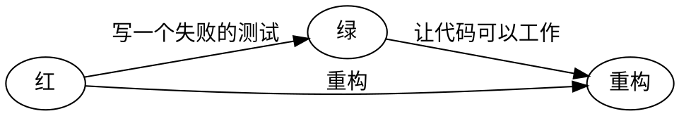
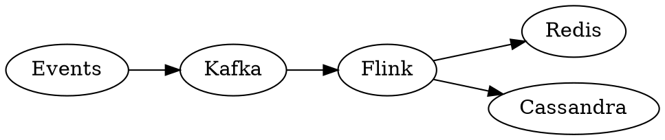
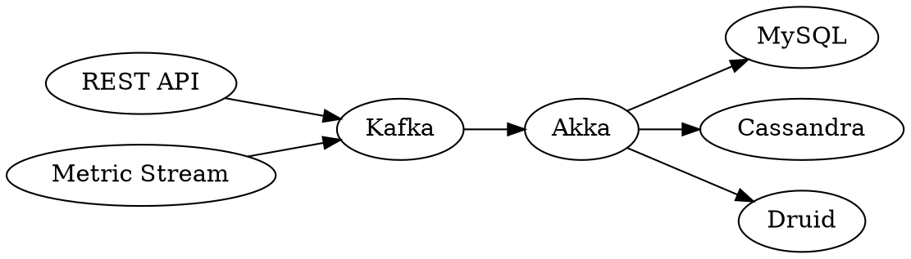

# 闭环

## DevOps 生命周期

```process-table
| 需求 | 开发  | 构建  | 测试 | 部署 | 运维 |
|-|-|-|-|-|-|
| 把运维人员作为首要干系人 | 小团队 | 构建工具 | 自动化测试 | 部署工具 | 监控 |
| 在开发需求时寻找他们的意见 | 有限的合作 | 支持持续集成 | 用户验收测试|支持持续部署|对错误情况做出响应 |
| | 单元测试 | | | |
```

效能提升过程：

```process-table
| 度量分析 | 实践固化 | 工程赋能 | 过程打通 |
|-|-|-|-|
```

## DevOps 四大支柱

来源：（《Effective DevOps》）

- **协作**。协作是通过支持多人的交互和输入来构建一个特定结果的过程。
- **亲密性**。不仅需要发展和维护个人之间的协作关系，还需要在组织内部、整个行业的团队和部分之间也需要建立紧密的关系。
- **工具**。工具是一个加速器，可以基于当前的文化和方向推动变化。
- **规模化**。规模化强调的是组织在整个生命周期中，所采用的过程和关键点。

## 三步工作法

《凤凰项目》中的三步工作法：


扩展资料：《[The Three Ways: The Principles Underpinning DevOps](https://itrevolution.com/the-three-ways-principles-underpinning-devops/)》

《DevOps 实践指南》 对应的示例：

```mindmap
 - 三步工作法
   - 流动原则
     - 使工作可见
       - Kanban
     - 限制在制制品数
     - 减少批量大小
     - 减少交接次数
     - 持续识别和改善约束点
       - 识别系统的约束点
          - 环境搭建
          - 代码部署
          - 测试的准备和执行
          - 紧耦合的架构
       - 决定如何利用这个系统约束点
       - 基于上述决定，考虑全局工作
       - 改善系统的约束点
       - 如果约束点已突破，回到第一点
     - 消除价值流中的困境和浪费
       - 类型
         - 半成品
         - 额外工序
         - 额外功能
         - 任务切换
         - 等待
         - 移动
         - 缺陷
         - 非标准或者手动操作
         - 填坑侠
   - 反馈原则
     - 在复杂系统中安全地工作
       - 管理复杂的工作，从中识别出设计和操作的问题
       - 群策群力解决问题，从而快速地构建新知识
       - 在整个组织中，将区域性的新知识应用到全局范围
       - 领导者要持续培养有以上才能的人
     - 及时发现问题
     - 群策群力，战胜问题获取新知
     - 在源头中保障质量
     - 为下游工作重心而优化
   - 持续学习和实验原则
     - 建立学习型组织和安全文化
     - 将日常工作的改进制度化
     - 将局部发布转化为全局优化
     - 在日常工作中注入弹性模式
     - 领导层强化学习文化
```

# 价值流驱动

## 做正确的事

我们的诸多软件实践，只是在正确的做事情。

## 实例化需求

### 需求代码化

Jira、Trello 等以特定的数据结果存储在数据库中，那么必然可以从代码中回溯出来。

### 故事原则

Bill Wake 提出了一个好用户故事的验收标准——[INVEST 模型](http://xp123.com/xplor/xp0308/index.shtml)，它由六个单词的首字母组成，分别是

- Independent：每个用户故事应该是独立的，不会和其他用户故事产生耦合
- Negotiable：并不会非常明确的阐述功能，细节应带到开发阶段跟程序员、客户来共同商议
- Valuable：每一个用户故事的交付都要能够给用户带来用户价值
- Estimable：不需要能够准确的估计，但需要能辅助客户排定优先级
- Small：要小一点，但不是越小越好，要大小合适，可以更容易的圈定故事范围
- Testable：需要能够进行验收测试，最好能把 Test Case 提前加进去

### 用户故事

#### 用户故事示例

```gherkin
# language: zh-CN
场景大纲: 用户查看 “我的” 页面未读消息数量提示
  Given 我收到消息
  When 我在“我的”页面
  Then 我可以看到未读消息计数

Note

1. 后端记录用户设备 ID 和用户 ID，记录每种消息的最近查看时间，根据此时间后的消息数量计算未读消息数量；
2. 超过 99 未读显示省略图标；
3. 时间展示规则:
1). 一小时内，显示为 xx 分钟前
2). 小于 24 小时，显示为 xx 小时前
3). 间隔超过 24 小时且小于 48 小时，显示：昨天
4). 间隔超过 48 小时，显示：MM-DD
5). 间隔超过一周：YY-MM-DD （ eg: 2019-03-01）
```

## 用户故事地图

# 转型

## 人

来源：Scott Prugh 《[Continuous Delivery](https://www.scaledagileframework.com/guidance-continuous-delivery/)》

```process-step
 - I 型（专家）
   - 精通某个领域
   - 其它领域的技能或经验很少
   - 很快遇到瓶颈
   - 对下游的浪费和影响不敏感
   - 抵制灵活或者可变的计划
 - T 型（通才）
   - 精通某个领域
   - 拥有很多领域的技能
   - 能突破瓶颈
   - 帮助制订灵活和可变的计划
 - E 型
   - 精通某几个领域
   - 有多个领域的实践经验，执行能力强，能持续创新
   - 潜力无限
```

## 团队变革

## 组织变革

### 组织类型

#### 组织类型学模型

Ron Westrum 组织类型学模型：组织如何处理信息

| 病态型         | 官僚型               | 生机型         |
| -------------- | -------------------- | -------------- |
| 隐瞒信息       | 忽略信息             | 各级探索信息   |
| 消灭信使       | 不重视信使           | 训练信使       |
| 逃避责任       | 各自担责             | 共担责任       |
| 阻碍团队的互动 | 容忍团队的互动       | 鼓励团队间结晶 |
| 隐瞒事故       | 组织是公道和宽容的   | 调查事故根因   |
| 压制新想法     | 认为新想法会造成麻烦 | 接纳新想法     |

—— 《DevOps 实践指南》

### 打造学习文化

在 ThoughtWorks 拥有这么一系列的培训（《[在 ThoughtWorks 我们如何做内部培训？](https://insights.thoughtworks.cn/how-we-do-training-in-thoughtworks/)》

- ThoughtWorks 内部培训
  - ThoughtWorks University，面向毕业生
  - ThoughtWorks Immersion，面向社招
  - Session（分享，一个小时以内）
  - WorkShop（动手），如 OO BootCamp、Ruby BootCamp
  - ThoughtWorks 内训（原郑大晔校）
  - 组内培训
  - 社区

### 康威定律

# 闭环：加快系统流动

> 系统化思维

精益思想五大原则:

- 价值（Value）
- 价值流（Value stream）
- 流动（Flow）
- 拉动（Pull）
- 尽善尽美（Perfection）

## 1. 持续集成

如《Jenkins 权威指南》一书指出，持续集成需要几个不同的阶段

- 阶段一：无构建服务器
- 阶段二：夜间构建
- 阶段三：夜间构建 + 自动化测试
- 阶段四：加入度量指标
- 阶段五：更认真地对待测试
- 阶段六：自动化验收测试和自动化部署
- 阶段七：持续部署

### 持续集成基本纪律

- 构建失败后，不要提交新的功能代码（仅限于修复）
- 提交前，在本地运行所有的提交测试
- 等持续集成测试通过后，再继续工作
- 回家之前，构建必须处于成功状态（CI 红不过夜）
- 时刻准备着回滚到前一个版本（CI Master）
- 在回滚之前，要规定一个修复时间
- 为自己导致的问题负责

### 通知

形式：

- 电子邮件
- RSS 订阅
- 即时消息
- IRC 通知
- 桌面通知
- 短信通知
- 移动通知
- 制造噪声
- 极端反馈设备（如 CI 灯）

### 主干开发策略

> 在版本控制的分支模型中，开发人员都在同一个被称为“主干“的分支中进行协作，多个开发人员的代码的汇聚在一起，从而避免创建长时间无法合并分支。因此，这种方式避免了合并地狱，也不会破坏构建，并从此让开发人员过上幸福的生活。

- 代码质量与知识共享
- 协同
- 部署频率和故障平均恢复时间

基本原则：

1. 所有修改都要尽可能出现在主干上。
2. 每个分支都应该在使用后删除。
3. 主干分支的提交都应该保证持续可用。


## 2. 自动化

### 自动化演进路径

自动化演进路径（《SRE：Google 运维解密》）：

1. 没有自动化。手动将数据库主进程在多位个位置之间转移。
2. 外部维护的、系统特定的自动化系统。
3. 外部维护的、通用的自动化系统
4. 内部维护的、系统特定的自动化系统
5. 不需要任何的自动化系统

### 自动化部署

#### 平均部署时间

| 公司     | 部署频率    | 部署交付期 | 可靠性 | 客户响应 |
| -------- | ----------- | ---------- | ------ | -------- |
| Amazon   | 23000 次/天 | 分钟       | 高     | 高       |
| Google   | 5500 次/天  | 分钟       | 高     | 高       |
| Netflix  | 500 次/天   | 分钟       | 高     | 高       |
| Facebook | 1 次/天     | 小时       | 高     | 高       |
| Twitter  | 3 次/周     | 高         | 高     |
| 普通企业 | 9 个月/次   | 月或季度   | 低/中  | 低/中    |

—— 《凤凰项目》

### 自动化部署策略

- 全部部署
  - 蓝绿部署
  - 滚动升级
- 部分部署
  - 金丝雀测试
  - A / B 测试

### 自动化测试

见测试

### 自动化运维

如（《SRE：Google 运维解密》）一书中介绍的『服务可靠度层级模型』：

```pyramid
 - 服务可靠度层级模型
   - 产品设计
   - 软件开发
   - 容量规划
   - 测试 + 发布
   - 事后总结问题根源分析
   - 应急事件处理
   - 监控
```

## 3. 代码化

### 版本化

每个 DevOps 阶段需要版本化的对象（《DevOps 最佳实践》）

| 阶段 | 版本化的对象                          | 工具化                         |
| ---- | ------------------------------------- | ------------------------------ |
| 规划 | 主题、史诗、特性                      | 需求管理工具                   |
| 编码 | S-CI、基线、数据模型                  | 软件管理工具 <br> 数据建模工具 |
| 构建 | 构建 ID                               | 构建服务器工具                 |
| 测试 | 测试数据 、测试用例、测试集、测试运行 | 测试管理 <br> 测试自动化工具   |
| 发布 | 发布说明、部署脚本、配置文件          | 发布工具                       |
| 运维 | 数据文件、协议                        | 数据文件管理工具               |
| 监控 | 监控配置文件                          | 监控系统                       |

### 基础设施即代码

> 基础设施即代码是一种基于从软件开发实践的基础设施自动化的方法。它强调系统及其配置的日常置备和变更具有一致性和可重复性。 —— 《基础设施即代码：云服务器管理》

#### 原则

- 系统能够被复制
- 系统是用完可扔的
- 系统是一致的
- 过程是可重复的
- 设计经常变更

#### 实践

1. 使用定义文件（definition file)
2. 自文档化的系统和流程
3. 一切版本化

- 可追溯性
- 回滚
- 相关性
- 可见性
- 可执行性

4. 持续测试系统和流程
5. 小的变更，而不是指变更

### 流水线即代码

> 流水线即代码 (Pipeline as Code) 通过编码而非配置持续集成 / 持续交付 (CI/CD) 运行工具的方式定义部署流水线。

1. 构建步骤脚本化
2. 添加脚本到持续集成
3. 集成自动化验证
4. 分支策略

Jenkinsfile 最佳实践（来源：《[Pipeline Best Practices](https://jenkins.io/doc/book/pipeline/pipeline-best-practices/)》

1.  确保 Groovy 代码在流水线中只作为胶水。
2.  避免流水线中的 Groovy 代码过于复杂
3.  减少重复相似流水线的步骤
4.  避免调用 `Jenkins.getInstance`

使用共享库：

1.  不要覆写内建的流水线步骤
2.  避免巨大的全局变量声明文件
3.  避免非常大的共享库

示例（来源《[流水线即代码](https://insights.thoughtworks.cn/pipeline-as-code/)》：

```groovy
node('master') {
   stage('Checkout') {…}
   stage('Code Analysis') {…}
   stage('Unit Test') {…}
   stage('Packing') {…}
   stage('Archive') {…}
   stage('DEV') {…}
}
stage('SIT') {
   timeout(time:4, unit:'HOURS') {
       input "Deploy to SIT?"
   }
   node('master') {…}
}
stage('Acceptance Test') {
   node('slave') {…}
}
```

### Deploy as Code

aka Deployment process as code

- Dockerfile

### 文档代码化

#### 文档代码化

> Docs like Code（文档代码化），是指采用开发软件的方式来开发文档，最后表现出文档和代码类似的现象。

它具备以下一些特征（《[软件技术文档代码化现象](https://zhuanlan.zhihu.com/p/33045831)》）

1.  **开发方式一致**。软件代码在开发的时候，基本流程是：写代码、审查代码和部署代码，文档在开发时候，也会采用和代码开发相同或类似的方式。
2.  **集成在开发流程中**。文档开发作为软件开发的一部分，也是最终产品的一部分，其开发过程是嵌入在整个软件开发过程中的。
3.  **开发工具一致**。文档写作时，一般使用代码编辑器如 Eclipse 或 Visual Studio Code，而不会用诸如 Word 或 FrameMaker 这类工具。
4.  **使用标记语言**。一般使用轻量级标记语言如 Markdown, reStructuredText 或 ASCii 等，或更复杂的 XML 等标记语言。
5.  **文档和代码共同存储**。例如使用 Github，代码和文档会在同一个 repo 下，开发人员和文档工程师都可以访问。
6.  **版本控制**。一般使用 git 或 svn 这类工具进行版本管理。
7.  **网站发布自动化**。内容写作完成后，一拉 Web Hook 就能自动发布为帮助页面。

常见的实践有：

- [ADR](https://www.phodal.com/blog/documenting-architecture-decisions/)（Architecture Decision Records，即架构决策记录）。是一个类似于亚历山大模式（即：设计模式）的短文本文件。（虽然决策本身不一定是模式，但它们分享着力量的特征平衡。）每个记录都描述了一组力量和一个响应这些力量的决策。请注意，决策是这里的核心部分，所以特定的力量可能出现在多个 ADR（架构决策记录） 中。

对应的系统实践：

- 《[【架构拾集】基于 Markdown 文档展示系统设计](https://www.phodal.com/blog/architecture-in-realworld-markdown-based-document-system-design/)》

#### 架构文档化

```quadrant
 - 选择架构描述方法
   - 正式
     - 能不到这里就不到
   - 徒劳
     - 回避这里
   - 社区
     - 演进到这里
   - 部落
     - 从这里开始

config: {"left": "易于分享", "right": "难以分享", "bottom": "难以变更", "top": "易于变更"}
```

## 4. 实例化需求

# 反馈：建立快速反馈

or 强化反馈环

## 1. 测试

### 测试驱动开发

> TDD 是测试驱动开发（Test-Driven Development）的英文简称，是敏捷开发中的一项核心实践和技术，也是一种设计方法论。TDD 的原理是在开发功能代码之前，先编写测试用例代码，通过测试代码确定编写什么产品代码。



#### TDD 三定律

- **定律一** 在编写不能通过的单元测试前，不可编写生产代码
- **定律二** 只可编写刚发无法通过的单元测试，不能编译也算不通过
- **定律三** 只可编写刚好足以通过当前失败测试的生产代码

#### 测试驱动循环

1. 每个特性都从一个验收测试开始
2. 分离测量进度的测试和捕捉回归的错误的测试
3. 从最简单的成功场景开始测试
4. 编写您愿意读的测试
5. 看着测试失败
6. 从输入开发到输出开发
7. 针对行为进行单元测试，而非针对方法
8. 聆听测试
9. 调整循环

—— 《测试驱动的面向对象软件开发》

#### 实例化需求

#### Tasking？

实例化需求：

- 从目标中获取范围
- 用实例进行描述
- 精炼需求说明
- 自动化验证，无须改变需求说明
- 频繁验证
- 演进出一个文档系统

### 整洁的测试

### FIRST 原则

如 Robert C. Martin 在《代码整洁之道》所说的那样，好的测试应该是：

- 快速（Fast），测试应该够快。
- 独立（Indendent），测试应该相互独立。
- 可重复（Repeatable），测试应当可在任何环境中通过。
- 自足验证（Self-Validating），测试应该有布尔值输出。
- 及时（Timely），测试应该及时编写。

要我说的话，它应该还有：

- **同一人编写**，测试应该由开发业务代码的编写。这样他/他们才知道自己代码写得烂。
- **边界**，测试直接不影响业务代码。这里指的主要是 private -> public 的行为，又或者是业务代码中包含测试代码，而非因为测试对原有代码重构。
- **有效命名**。测试信息应该体现在方法名上，表达某一个特定的需求。

测试代码应该遵循生产代码的质量标准。

## 2. 代码回顾

来源：《深入核心的敏捷开发》

```mindmap
 - 代码回顾（CodeReview)
   - 目的：学习 vs 挑错
   - 重点
     - 代码 vs 作者
     - 习惯 vs bug
     - 模式 vs 反模式
   - 注意
     - 整洁代码 vs 我的写法
     - 整洁代码 vs 重新设计
   - 形式
     - 随机摄取代码（当天编写的）
     - 每日一次，每次半小时以内，每次回顾 200~300 行代码
```

PS：时间视真实的团队而定，如果不能每天进行代码回顾，时间一般控制在 0.5 ~ 1 小时内。

### 基本实践

基本过程：

```process-table
| 回顾 | 概述 | 检视 | 总结 |
|-|-|-|-|
| 回顾上次提到的问题及解决情况 | 简述本次检视的代码内容 | 逐行代码进行检视，讨论和记录问题 | 复述发现的问题和结论，做好记录 |
```

实践：

- 寻找一个适合多人回顾的显示器
- 线下集中优先，远程次之
- 制定回顾时间，及对应的回顾组织者（定期更换）
- 先讲述用户故事（业务视角），再讲述实现视角
- 当天代码，当天回顾
- 未提交的代码不回顾（除非遇到问题）
- 并非所有的代码都要回顾（根据需要）
- 回顾时，随时记录修改的内容
- 下次回顾时，需要检视上次的修改部分
- 意见不统一时（小问题以规范为主），可以再次讨论（或是会议）
- 功能过大时，可以考虑以小型 session / 专题的形式讲述

回顾的方式：

- 由提交者，讲述编写的代码
- 由其他/她人讲述提交者编写的代码

不能按时回顾时：

- 改天，并拿出更多的时间
- 积累过多未回顾代码时，Tech Lead 应当检视其他/她人写的代码

## 3. 小步前进

> 小步前进是一系列步骤的集合，其目的是：集成越早问题越小。

### 小步提交

1. 一次本地提交只做一件事情
2. 一次远程提交只做一个用户故事
3. 频繁进行本地提交

### Git Hooks

Git 钩子列表：

```bash
applypatch-msg     post-merge         pre-auto-gc        prepare-commit-msg
commit-msg         post-receive       pre-commit         push-to-checkout
post-applypatch    post-rewrite       pre-push           update
post-checkout      post-update        pre-rebase
post-commit        pre-applypatch     pre-receive
```

Commit Hook 示例：

```process-table
| 执行提交脚本 | 执行 pre-commit  | 执行 Checkstyle| 执行预置的 lint | 提交代码 |
|-|-|-|-|-|
| git-cz | husky | checkstyle | lint-staged | git commit |
| conventional-changelog| commitlint | prettier  | | |
| |  | | | |
```

Push Hook 示例：

```process-table
| git push | 执行 prePush | 执行 lint | 执行 testing | 提交 |
|-|-|-|-|-|
```

提交信息规范（《[如何好一个 Git 提交信息及几种不同的规范](https://www.phodal.com/blog/how-to-write-a-better-git-commit-message/)》）：

- **build**: 影响构建系统或外部依赖关系的更改（示例范围：gulp，broccoli，npm）
- **ci**: 更改我们的持续集成文件和脚本（示例范围：Travis，Circle，BrowserStack，SauceLabs）
- **docs**: 仅文档更改
- **feat**: 一个新功能
- **fix**: 修复错误
- **perf**: 改进性能的代码更改
- **refactor**: 代码更改，既不修复错误也不添加功能
- **style**: 不影响代码含义的变化（空白，格式化，缺少分号等）
- **test**: 添加缺失测试或更正现有测试

## 4. 高频率发布

## 5. 可视化

### 监控

### 监控分层模型

出自《DevOps 最佳实践》一书：

```mindmap
 - 监控分层模型
     - 系统监控
       - 服务监控
          - 基础设施服务
          - 应用程序服务
       - 资源监控
          - CPU
          - 内存
          - 带宽
          - ……
       - 内建监控
          - 应用中的监控机制
       - 事件监控
          - 基础设施组件事件
          - 基础设施服务事件
          - 应用程序事件
     - 应用程序监控
       - 应用程序接口监控
          - 健康度？
       - 基础设施服务监控
     - 信息系统监控
       - 信息系统 E2E 监控
       - 基础设施 E2E 监控
       - 基础设施域监控
     - 链路监控
       - 信息流 E2E 监控
       - 业务流程 E2E 监控
       - 终端用户 E2E 监控
```

### Dashborad

Dashing: http://dashing.io/

# 持续：持续创新文化

or 持续实验文化

## 持续学习

### 技术打磨

#### 练习入门

出自《[演进：在工作的前三年里快速成长（练习篇）](https://www.phodal.com/blog/evolution-how-to-practise/)》

#### 练习的进阶

诀窍（《[练习技术的诀窍](https://www.phodal.com/blog/how-to-make-practise-works/)》

- 可持续性：寻求量变
  - 让自己保持稳定的作息
  - 稳定的输出
  - 有充分的练习内容
- 可度量
  - SMART
- 可视化：产生仪式感
- 小步前进
- 里程碑：成就感

建议:

- 从模仿开始
- 时间限制的练习
- 日常积累灵感
- 用专业的工具

#### 高产

> 精通 one，学习 another，关注 next。 —— justjavac

高产策略（《[如何高产](https://www.phodal.com/blog/how-to-be-high-performance/)》

- 制定时间、目标和产出策略
  - 长期目标，一个小目标
  - 时间投入收益比对
  - 知识沉淀：输出优于输入
  - 不造轮子，再造轮子
  - 技能图谱：寻找、练习、升华
- 练习所需要的技能
- 寻找合适的工具，并打磨工具和手艺
- 练习速度、质量
- 通过休息来提出产出

## 持续部署

发布工程哲学：

- 自服务模型
- 追求速度
- 密闭性
- 强调策略和流程

## 追求卓越

### 测试即文档

『单元测试是可执行的文档』

## 优化

### 童子军规则

> 提交的代码要比检出的更好

### 技术债务管理

技术债治理的四条原则（《[技术债治理的四条原则](https://insights.thoughtworks.cn/managing-technical-debt/)》）：

1. 核心领域优于其他子域
2. 可演进性优于可维护性
3. 明确清晰的责任定义优于松散无序的任务分配
4. 主动预防优于被动响应

# 工程实践

## 依赖管理

### 二进制管理 vs 源码依赖管理

|          | 二进制依赖管理                                                       | 源码依赖管理                                                                          |
| -------- | -------------------------------------------------------------------- | ------------------------------------------------------------------------------------- |
| 构建速度 | 直接使用二进制文件，速度快                                           | 所有代码全量构建，速度慢                                                              |
| 重构支持 | 不能同时修改依赖的代码和项目自身的代码，重构困难                     | 可以同时修改项目自身和依赖的代码，重构简单                                            |
| 提交操作 | 不同的代码仓库在不同的工作空间下分别提交代码，管理简单，效率较高     | 在同一个工作空间下管理多个仓库代码，代码修改分别提交到不同的仓库，容易出错 ，效率较低 |
| 开发调度 | 调度时无法跟踪到源码，即使发现依赖的问题，也无法修改                 | 调试时可以看到源码，发布问题时也可以即时修改                                          |
| 响应变化 | 发布需求和问题时，需要寻找依赖提供方的帮助，并放在下一次的开发计划中 | 可以直接修改并马上应用                                                                |

# 敏捷实践

## 极限编程实践

极限编程的价值观（《学习敏捷》）：

- **沟通**。每个团队成员都清楚其他人在做什么。
- **简化**。开发 保内尽量让写出的代码简单、直接。
- **反馈**。不断进行测试和反馈，以保证产品的持量。
- **勇气**。每个团队成员都应该专注于为项目作出更佳的选择，即使这意味着不得不抛弃失败的方案而从不同的角度去解决问题。
- **尊重**。每个团队成对项目都是重要的、有价值的。

对应的实践整理如下：

```process-step
 - 反馈
   - 测试驱动开发
   - 计划游戏
   - 用户代表
   - 结对编程
 - 持续流程
   - 持续集成
   - 代码重构
   - 小的发布
 - 代码理解
   - 简单设计
   - 代码集体所有制
   - 编码标准
   - 系统隐喻
 - 工作环境
   - 每周 40 小时
```

### 结对编程

模式：

- 领航员和驾驶员（Driver-Navigator）。键霸出没，请小心。
- 乒乓模型。基于测试驱动开发的模式
- 鼠标和键盘模式。

注意事项：

1.  多沟通
2.  确定开发任务列表
3.  定期交换小伙伴
4.  可持续的结对工作
5.  多给新人机会
6.  勇敢加勇敢
7.  反馈
8.  不是所有的场景都适合结对

# 测试

```quadrant
 - 测试四象限 （Brain Marick）
     - 自动/手动
       - 用户故事测试
       - 端到端测试
       - 回归测试
       - ……
     - 手动
       - 探索式测试
       - 用户验收测试
       - 用户演示（showcase）
       - 用户培训
       - 安全测试（业务部分）
       - ……
     - 自动化
       - 单元测试
       - 组件测试
       - 集成测试
       - ……
     - 工具
       - 安全测试（技术部分）
       - 性能测试
       - 辅助功能测试
       - ……

config: {"left": "支持团队", "right": "评价产品", "bottom": "面向技术", "top": "面向业务"}
```

## 敏捷测试原则：

—— 出处：《[ThoughtWorks 的敏捷测试](https://insights.thoughtworks.cn/thoughtworks-agile-testing/)》

1. 我们的目标在于和团队一起尽快地交付高质量软件。
2. 测试人员尽早参与软件早期阶段，与所有团队角色合作，通过实例化需求，确保对业务价值理解的一致性。
3. 测试人员关注生产环境状态，收集数据，指导和优化前期的分析、开发和测试。
4. 测试人员和开发人员同处一个产品项目团队，而不是独立的测试团队或部门。
5. 测试人员负责探索性测试，和开发人员结对，设计、实现和维护自动化测试。
6. 自动化测试在流水线中持续精准执行，快速发现每次代码提交对于已有功能的影响
7. 测试数据对于自动化测试是充分的，并能按需获得。
8. 测试活文档化，和代码一起，作为知识资产进行版本化管理。
9. 自动化测试需要有效的分层。
10. 预防缺陷，而不是关注缺陷的数量。

### 团队为质量负责

所有人应该对质量负责：


从流程上来说：

- 缺乏单元测试。
- Code Review 没有有效实施。
- 没有结对编程。内部存在一定的结对编程
- 测试。测试缺乏对这种场景的测试情况
- 紧急修复。热修复不支持，只能通过新版本解决。

## 测试金字塔

```pyramid
 - 测试金字塔
   - 集成测试
   - 组件测试
   - 单元测试
```

- **单元测试**。
- **集成测试**。
- **系统测试**。

### 生产测试

又被称之为黑盒测试，包含了：

- 黑盒测试
- 压力测试
- 金丝雀测试

## 测试策略

来源：《[一页纸测试策略](https://mp.weixin.qq.com/s/cEkI3Duyg-Jqk-TTFwKVqQ)》

> 质量内建，旨在软件交付过程的早期发现并预防缺陷，将任务移动到软件开发生命周期的左侧来提高质量，测试人员可以从需求分析阶段开始介入。

```process-table
| 需求分析 | 开发前 | 开发  | 开发完成 | 测试|  发布前|已发布 |
|--|--|--|--|--|--|--|
| 用户故事评审 | 特性启动 | 单元测试 | 用户故事验收 | 用户故事测试 | 回归测试 | 监控 |
| 估算 | 测试用例设计 | 组件测试 | 底层测试评审 | 探索式测试 | 发布指南 | 支持 |
| 方案设计 | 用户故事启动 | | 发布可测试版本 | 缺陷管理 | 用户验收测试 | 质量分析 |
| 迭代计划 | 测试计划 | | | 风险评估 | 发布版本确认 | |
| | | | | 集成测试 | | |
| | | | | 端到端测试 | | |
```

### 契约测试

#### 消费者驱动的契约测试

> 消费者驱动契约测试（Consumer-Driven Contracts Testing）背后的理念是定义每个服务消费者与提供者之间的契约，然后根据该契约对消费者和提供者进行独立测试，以验证他们是否符合契约约定的事项。

- [Moco](https://github.com/dreamhead/moco) + [Moscow](https://github.com/macdao/moscow)
- [Spring Cloud Contract](https://spring.io/projects/spring-cloud-contract)
- [Pact](https://docs.pact.io)

Resources: [Qixi's presentations](https://github.com/macdao/presentations)

## 自动化测试

### 引入自动化测试的策略

- 先测新增代码
- 先测高价值代码
- 先测稳定代码
- 先做冒烟测试
- 为缺陷增加测试

### 自动化测试成本

#### 一次性投入

- 学习的成本
- 搭建环境的成本

#### 持续性投入

- 编写自动化测试用例的成本
- 维护自动化测试用例的成本

### 自动化测试原则

- 测试用例之间保持独立
- 一个测试用例只做一件事情
- 测试的结果必须稳定
- 单元测试用例必须足够的快

测试过慢

- E2E 测试定期执行
- 拆分测试策略
- 检视以往的测试。删除无用的
- 并行执行测试

### 三段式测试

- BDD 方式（Given-When-Then）
- 设置-操作-断言（Arrange-Act-Assert）

Given-When-Then 表达方式可以称之为一个公式一个模板，这种方式旨在指导程序员为“用户故事”编写测试用例变得方便。

- Given 一个上下文，指定测试预设
- When 进行一系列操作，即所要执行的操作
- Then 得到一系列可观察的后果，即需要检测的断言

E2E 定义示例：

```javascript
defineSupportCode(function ({ Given, When, Then }) {
  Given('当我在网站的首页', function () {
    return this.driver.get('http://0.0.0.0:7272/');
  });

  When('输入用户名 {string}', function (text) {
    return this.driver.findElement(By.id('username_field')).sendKeys(text);
  });

  When('输入密码 {string}', function (text) {
    return this.driver.findElement(By.id('password_field')).sendKeys(text);
  });

  When('提交登录信息', function () {
    return this.driver.findElement(By.id('login_button')).click();
  });

  Then('页面应该返回 {string}', function (string) {
    this.driver.getTitle().then(function (title) {
      expect(title).to.equal(string);
    });
  });
});
```

### 测试替身

> 有时候对被测系统(SUT)进行测试是很困难的，因为它依赖于其他无法在测试环境中使用的组件。这有可能是因为这些组件不可用，它们不会返回测试所需要的结果，或者执行它们会有不良副作用。在其他情况下，我们的测试策略要求对被测系统的内部行为有更多控制或更多可见性。 如果在编写测试时无法使用（或选择不使用）实际的依赖组件(DOC)，可以用测试替身来代替。测试替身不需要和真正的依赖组件有完全一样的的行为方式；他只需要提供和真正的组件同样的 API 即可，这样被测系统就会以为它是真正的组件！ ——Gerard Meszaros

| 类型         | 解释                                                                                                                                     |
| ------------ | ---------------------------------------------------------------------------------------------------------------------------------------- |
| Dummy Object | 不包含实现的对象（Null 也是），在测试中需要传入，但是它没有被真正地使用，通常它们只是被用来填充参数列表。                                |
| Fake         | 有具体实现的，但是实现中做了些捷径，使它们不能应用与生产环境（举个典型的例子：内存数据库）                                               |
| Stub         | 状态验证。返回固定值的实现                                                                                                               |
| Spy          | 行为验证。类似于 Stub，但会记录被调用那些成员，以确定 SUT（System Under Test）与它的交互是否是正确的                                     |
| Mock         | 由 Mock 库动态创建的，能提供类似 Dummy、Stub、Spy 的功能。开发人员看不到 Mock object 的代码，但可以设置 Mock object 成员的行为及返回值。 |

Mock 和 Stub 就是常见的两种方式：

- Stub 是一种状态确认，它用简单的行为来替换复杂的行为
- Mock 是一种行为确认，它用于模拟其行为

示例见：《[测试替身](https://growth.phodal.com/#%E6%B5%8B%E8%AF%95%E6%9B%BF%E8%BA%AB)》

### 简单规则

测试自动化应该遵循的简单规则

| 规则                             | 理由                                                                                                                                           |
| -------------------------------- | ---------------------------------------------------------------------------------------------------------------------------------------------- |
| 单一职责                         | 易于调试：业务规则变更时易于修改                                                                                                               |
| 不要重复自己                     | 能够只改一个地方                                                                                                                               |
| 使用领域特定语言                 | 使测试人员相关的沟通更加容易                                                                                                                   |
| 抽象测试                         | 使测试更加易读                                                                                                                                 |
| 设置和清除（setup & teardown     | 可以重复执行测试                                                                                                                               |
| 避免访问数据库（尽可能）         | 访问数据库会使测试变慢（注意，有些情况还是需要访问数据库的）                                                                                   |
| 测试必须一直保持绿色             | 保证测试的信心：活文档                                                                                                                         |
| 应用公共测试标准（包括命名约定） | 可以共享代码或者测试的所有权，对测试达成共识                                                                                                   |
| 将测试（什么）和（如何）执行分隔 | 把什么（和为什么）抽象出来可以让各层分别完善；为使人读懂规则说明（测试），你可以增加更多示例，或者在不会影响精力规则的前提下更改底层自动化实现 |

## 测试驱动开发

依据 J.Timothy King 所总结的《[测试先行的 12 个好处](http://sd.jtimothyking.com/2006/07/11/twelve-benefits-of-writing-unit-tests-first/)》：

- 测试可证明你的代码是可以解决问题的
- 一面写单元测试，一面写实现代码，这样感觉更有兴趣
- 单元测试也可以用于演示代码
- 会让你在写代码之前做好计划
- 它降低了 Bug 修复的成本
- 可以得到一个底层模块的回归测试工具
- 可以在不改变现有功能的基础上继续改进你的设计
- 可以用于展示开发的进度
- 它真实的为程序员消除了工作上的很多障碍
- 单元测试也可以让你更好的设计
- 单元测试比代码审查的效果还要好
- 它比直接写代码的效率更高

详见：《[测试驱动开发](https://growth.phodal.com/#%E6%B5%8B%E8%AF%95%E9%A9%B1%E5%8A%A8%E5%BC%80%E5%8F%91)》

## 测试代码坏味道

详见：《[测试代码的坏味道](https://www.phodal.com/blog/test-bad-smell/)》

> 测试代码坏味道，是指单元测试代码中的不良编程实践（例如，测试用例的组织方式，实现方式以及彼此之间的交互方式），它们表明测试源代码中潜在的设计问题。

常见的测试坏味道：

- 空的测试。测试是生成的，但是没有内容。
- 忽略的测试。即测试被 Ignore
- 没有断言的测试。为了测试覆盖率而出现的测试
- 多余的 Println。调试时留下的讯息。
- 多重断言。每个测试函数只应该测试一个概念。

然后，再来个 Examples。

## 测试覆盖率

### 测试覆盖率曲线

```echarts
{
    "xAxis": {
        "type": "category"
    },
    "yAxis": {
        "type": "value"
    },
    "series": [{
        "data": [0, 1, 5, 10, 9, 14, 15, 30, 40, 45, 54, 60, 58, 65, 60, 70, 75, 78, 76, 80, 82, 83, 84, 85, 86, 87, 92, 95, 98, 97, 99, 98, 99, 98, 97, 99],
        "type": "line",
        "smooth": true
    }]
}
```

# 度量

## 评估与度量

### DevOps 四个关键指标

```mindmap
 - 提升交付效能
   - 部署频率
     - 批量的大小
     - 自动化程度
     - 测试效率
     - 部署效率
     - 构建效率
     - ……
   - 交付前置时间
     - 需求稳定性
     - 任务交接
     - 等待时间
     - 团队速度
     - 返工庇
     - ……
   - 平均恢复时间
      - 监测的效率
      - 系统可配置性
      - 系统可维护性
      - 日志可用性
      - 架构质量
      - ……
   - 变更失败率
      - 自动化程度
      - 架构质量
      - 基础设施即代码
      - 测试质量
      - 测试代码质量
      - 代码质量
        - 编码规范
        - 重复代码
        - 测试覆盖率
        - 扇入扇出度
        - 圈复杂度
        - ……

```

### 成熟度评估表格模型

| 产品/项目 | 维度     | 指标项       | 指标解读                                   | 单位 | 数据采集方式 | 值  |
| --------- | -------- | ------------ | ------------------------------------------ | ---- | ------------ | --- |
|           | 交付效率 | 交付前置时间 | 需求前置时间：从需求提出，到上线的时间周期 | 天   | 自动/手动    | 1.5 |

```
| 产品/项目 | 维度 | 指标项 | 指标解读 | 单位 | 数据采集方式| 值 |
|-|-|-|-|-|-|-|
| | 交付效率 | 交付前置时间 | 需求前置时间：从需求提出，到上线的时间周期 | 天| 自动/手动 | 1.5 |
```

### 度量维度

- 需求管理：平均需求交付时长
- 开发管理：单元测试覆盖率、平均修复问题时间、问题打回率、代码注释率、代码质量
- 构建管理：构建频率、平均构建时间、构建成功率
- 部署管理：部署频率、平均部署时间、部署成功率
- 进度管理：任务燃尽数

### 常见低效原因

如我司同事说：《[DevOps —— 实施 DevOps 应该考虑的若干问题](https://blog.csdn.net/gudufeiyang/article/details/104190250)》

- **技术债务**：长期以来，开发团队只注重新功能的开发，不注意重构和流程改进，不注重新技术、新方法的运用。
- **团队协作和流程**：传统的方式，开发团队和运维团队的工作是分离的。他们有不同考核和业务目标；工作过程中的协作方式基本依靠流程或电子流。
- **系统架构不合理**：耦合度高，导致开发过程中的问题和领域不能被合理的分割，部署和运维过程也可能会导致整个系统崩溃。
- **研发方法和流程不科学**：研发过程不够敏捷，或者敏捷过程中的重要实践并未正确的执行。
- **人员技能偏低**：人员技能不足，无法支撑项目的架构设计、疑难技术的攻坚，无法满足业务的运维要求。
- **团队文化**：没有形成良好的学习文化，在面对问题时指责、惩罚是重要手段，无法让所有成员坦诚的分析问题，无法从失败中学习技术和经验。

### 度量标准

#### 可用性度量

可用性度量公式：

> 网站可用性百分比 = （该期间的总秒数 - 系统宕机的秒数） / 该期间的总秒数

| 可用性 %             | 每年的故障时间 | 每月的故障时间 | 每周的故障时间 | 每天的故障时间 |
| -------------------- | -------------- | -------------- | -------------- | -------------- |
| 55.5555555% (9 个 5) | 162.33 天      | 13.53 天       | 74.92 小时     | 10.67 小时     |
| 90% (1 个 9)         | 36.53 天       | 73.05 小时     | 16.80 小时     | 2.40 小时      |
| 95% (1.5 个 9)       | 18.26 天       | 36.53 小时     | 8.40 小时      | 1.20 小时      |
| 97%                  | 10.96 天       | 21.92 小时     | 5.04 小时      | 43.20 分钟     |
| 98%                  | 7.31 天        | 14.61 小时     | 3.36 小时      | 28.80 分钟     |
| 99% (2 个 9)         | 3.65 天        | 7.31 小时      | 1.68 小时      | 14.40 分钟     |
| 99.5% (2.5 个 9)     | 1.83 天        | 3.65 小时      | 50.40 分钟     | 7.20 分钟      |
| 99.8%                | 17.53 小时     | 87.66 分钟     | 20.16 分钟     | 2.88 分钟      |
| 99.9% (3 个 9)       | 8.77 小时      | 43.83 分钟     | 10.08 分钟     | 1.44 分钟      |
| 99.95% (3.5 个 9)    | 4.38 小时      | 21.92 分钟     | 5.04 分钟      | 43.20 秒       |
| 99.99% (4 个 9)      | 52.60 分钟     | 4.38 分钟      | 1.01 分钟      | 8.64 秒        |
| 99.995% (4.5 个 9)   | 26.30 分钟     | 2.19 分钟      | 30.24 秒       | 4.32 秒        |
| 99.999% (5 个 9)     | 5.26 分钟      | 26.30 秒       | 6.05 秒        | 864.00 毫秒    |
| 99.9999% (6 个 9)    | 31.56 秒       | 2.63 秒        | 604.80 毫秒    | 86.40 毫秒     |
| 99.99999% (7 个 9)   | 3.16 秒        | 262.98 毫秒    | 60.48 毫秒     | 8.64 毫秒      |
| 99.999999% (8 个 9)  | 315.58 毫秒    | 26.30 毫秒     | 6.05 毫秒      | 864.00 微秒    |
| 99.9999999% (9 个 9) | 31.56 毫秒     | 2.63 毫秒      | 604.80 微秒    | 86.40 微秒     |

#### 自动化测试度量指标

- 自动化测试用例数。
- 自动化测试覆盖率。
- 自动化测试通过率。
- 自动化测试执行时长。
- 自动化测试执行频率。

#### 质量属性

Lionheart 项目的场景属性场景：

| 质量属性 | 场景                                                              | 优先级 |
| -------- | ----------------------------------------------------------------- | ------ |
| 可用性   | 招标数据库无响应时，系统应记录错误日志，并在 3 秒内用历史数据代替 | 高     |
| 可用性   | 用户搜索公开的招标文件，一年中 99% 的时间都能正常获取结果列表     | 高     |
| 可伸缩性 | 可以在计划维护窗口（7 小时）内添加新服务器                        | 低     |
| 性能     | 当系统处于每秒 2 次搜索的平均负载时，用户可在 5 秒内看搜索结果    | 高     |
| 可靠性   | 招标文件更新应该在变更后 24 小时内反映出来                        | 低     |
| 可用性   | 用户触发的更新（如收藏招标文件）应在 5 秒内反映在系统中           | 低     |
| 可用性   | 系统可以处理每秒 10 次搜索的峰值负载，平均响应时间下降不超过 10%  | 低     |
| 可伸缩性 | 预设数据增长率为每年 5%，系统应该能轻松应付                       | 低     |

—— 《架构师修炼之道》

# 工具

## 选择工具

### BDD 工具选型

> Behavior Driven Development，行为驱动开发是一种敏捷软件开发的技术，它鼓励软件项目中的开发者、QA 和非技术人员或商业参与者之间的协作。

《[BDD 框架对比: Cucumber.js vs Robot Framework vs Gauge.js](https://github.com/phodal/bdd-frameworks-compare)》

考虑到情况有：

- 团队水平
- 语言因素。持续学习文化
- 文档丰富度

## 制造工具

```process-table
| 个人实践 | 记录流程 | 形成统一语言 | 抽象原则与模式 | 标准化流程（工具） |
|-|-|-|-|-|
```

# 监控

不同级别的栈的监控目的

| 监控目标           | 数据来源       |
| ------------------ | -------------- |
| 发现检测           | 应用和基础设施 |
| 性能降低检测       | 应用和基础设施 |
| 容量规划           | 应用和基础设施 |
| 针对业务的用户反应 | 应用           |
| 入侵检测           | 应用和基础设施 |

## APM

> APM 即应用性能管理，主要指对企业的关键业务应用进行监测、优化，提高企业应用的可靠性和质量，保证用户得到良好的服务，降低 IT 总拥有成本(TCO)。

### Apdex

> Apdex 全称是 Application Performance Index，是由 Apdex 联盟开放的用于评估应用性能的工业标准。Apdex 联盟起源于 2004 年，由 Peter Sevcik 发起。Apdex 标准从用户的角度出发，将对应用响应时间的表现，转为用户对于应用性能的可量化为范围为 0-1 的满意度评价。

Apdex 定义了应用响应时间的最优门槛为 **T**，另外根据应用响应时间结合 T 定义了三种不同的性能表现：

- **Satisfied（满意）**：应用响应时间低于或等于 T（T 由性能评估人员根据预期性能要求确定），比如 T 为 1.5s，则一个耗时 1s 的响应结果则可以认为是 satisfied 的。
- **Tolerating（可容忍）**：应用响应时间大于 T，但同时小于或等于 4T。假设应用设定的 T 值为 1s，则 4 \* 1 = 4 秒极为应用响应时间的容忍上限。
- **Frustrated（烦躁期）**：应用响应时间大于 4T。

| Apdex 值           | 颜色 | 说明                                                   |
| ------------------ | ---- | ------------------------------------------------------ |
| 0.75 ≤ Apdex ≤ 1   | 绿色 | 表示应用、实例或事务被调用时响应很快，用户体验较满意。 |
| 0.3 ≤ Apdex < 0.75 | 黄色 | 表示应用、实例或事务被调用时响应较慢，用户体验一般。   |
| 0 ≤ Apdex < 0.3    | 红色 | 表示应用、实例或事务被调用时响应极慢，用户体验较差。   |

### 开源 APM

- [PinPoint](https://github.com/naver/pinpoint) 韩国开源的一个功能完备的 APM 系统，支持 JVM 性能数据采集、服务 Trace、告警等功能。它具有应用程序无侵入的应用特性。
- [ZipKin](https://zipkin.io/) 是 Twitter 开源的 Trace 工具，通过 Java 程序中引入客户端，可隐式拦截 Http、Thrift 等形式服务调用。
- [SkyWalking](https://skywalking.apache.org/zh/) 是一个开源 APM 系统，为微服务架构和云原生架构系统设计。它通过探针自动收集所需的指标，并进行分布式追踪。
- [Prometheus](https://prometheus.io/) 是一个开源的系统监控和报警工具。
- [CAT](https://github.com/dianping/cat) 是基于 Java 开发的实时应用监控平台，为美团点评提供了全面的实时监控告警服务。
- [Hawkular](https://www.hawkular.org/) 一个功能完备的 APM 系统，应用程序中嵌入 Hawkular 客户端，主动将采集数据通过 Http 或者 Kafka 传递给 Hawkular。

## 异常管理

### 异常分类

- 规划
  - 针对于所有的主题（Themes 大故事）和史诗故事（Epics）
  - 确认错误路径
  - 复用鱼骨图（石川图）找到导致错误路径的根本原因
  - 完成健康模型
- 编码
  - 针对每个特性
  - 识别额外的错误路径，识别根本原因（鱼骨分析）和完成健康模型
  - 完成事态分类
  - 构建单元测试用例来检测将要写入的事态
  - 创建包含异常处理的源代码
  - 在源代码中添加需要补充的事态，并调整鱼骨分析、健康模型和异常文件
  - 编写脚本来改变监控您的预设
- 构建
  - 编译源代码到目标代码，同时为错误路径运行单元测试用例
  - 确保所有的事态能够被单元测试覆盖
- 测试
  - 为错误路径运行涵盖监控预设的系统测试和系统集成测试
  - 确保所有事态能够被系统测试和系统集成测试命中
- 发布
  - 确保健康模型、事态分类和异常文件覆盖率
- 部署
  - 部署目标码、更新监控规则的脚本来更改监控的预设
- 运维
  - 当提供的解决方案无效时，向开发人员反馈
- 监控
  - 当事态没有被正确检测到时，向开发人员反馈
  - 当没有预见到的事态发生时，请开发人员调整鱼骨分析、健康模型和异常文件

## 监控

### 告警系统

各类告警架构对比（来源：[https://www.ituring.com.cn/article/497377](https://www.ituring.com.cn/article/497377)）

| 方案                         | 简述                                                                                | 实时流式计划（单条） | 分布式 | 状态管理（中间数据等） | 延迟   | 语言支持                       | Hadoop 整合  | 执行方式  |
| ---------------------------- | ----------------------------------------------------------------------------------- | -------------------- | ------ | ---------------------- | ------ | ------------------------------ | ------------ | --------- |
| 现有方案（Akka + Cassandra） | 状态依赖于外部存储（Cassandra 不一定抗得住）                                        | 支持                 | 不支持 | 不支持，依赖外部存储   | 不好说 | Java                           | 没有整合     |           |
| 现有方案改造（Akka + Redis   | 状态依赖于外部存储（Redis）衍生出其它不可能的单点故障，而且开发工作量和难度大       | 支持                 | 支持   | 不支持，依赖外部存储   | 不好说 | Java                           | 没有整合     |           |
| Spark Streaming              | Spark Streaming 哪里都好，就是不支持真正意义上的流式计划（单条）                    | 不支持（小批量）     | 支持   | 有状态（RDD）          | 秒级   | Java, Scala, Python            | 整合得比较好 | Stage     |
| Storm                        | Storm 为流式计算而生，但是无法满足我们需要状态管理的场景，需要引入 外部存储。另外？ | 支持                 | 支持   | 无状态                 | 毫秒级 | Ruby, Python, Perl, JavaScript | 整合一级     |           |
| Flink                        | 流计算方面综合了上面两者的优点，且基于 pipeline 模式要优于 Spark 的 Stage 模式      | 支持                 | 支持   | 有状态，自己管理内容   | 毫秒级 | Java, Scala, Python            | 整合非常好   | Pipelined |

#### OneAPM 架构

CEP 1.0：



CEP 2：

解析计算引擎 -> 处理队列引擎 -> 分布式管理平台 -> 操作接口

SQL DSL -> Antlr -> AST Tree -> Process Model -> Event Process Result



# 分析

## 大数据处理

```process-table
| 数据源 | 数据集成 | 数据存储 | 数据分析 | 数据可视化 |
|-|-|-|-|-|
| 结构化数据 | 数据收集 | 对象存储 | 机器学习 | 报表 |
| 非结化数据 | 数据清理 | 文件存储 | 深度学习 | 图表 |
|          | 数据清理 | 数据库   |        | 仪表盘 |
|          | 数据处理 |         |        |       |
```

### 大数据工具

```process-step
 - 数据源
    - CSV
    - TXT
    - 音频、视频
    - 图片
    - 数据库
 - 数据集成
    - Spark
    - Flink
    - NiFi
    - Kafka
    - RabitMQ
    - Pentaho
 - 数据存储
    - HDFS
    - MINIO
    - Neo4j
    - PostgreSQL
    - MongoDB
    - MariaDB
    - Hbase
 - 数据分析
    - Scikit Learn
    - Keras
    - Numpy + Pandas
    - Tensorflow
 - 数据可视化
    - Dashing
    - D3.js
    - Leaflet
    - Echarts
```

### 数据-价值金字塔

```pyramid
 - 数据-价值金字塔
  - 收集、展示、披露单条数据记录：数据记录
  - 清洗、聚合、可视化、问题：图表
  - 结构、链接、元数据、标签、探索、交互、分享：图表
  - 整理、推荐、理解、推断、学习：预测
  - 驱动、价值、影响、更改、变化、交付：行动
```

——《敏捷数据科学》

- **数据记录**。整个栈中对原子数据记录的处理和展示
- **图表**。从数据记录中提出数据的不同属性进行汇总，并把它们绘制成图表
- **执行**。从数据中提取关系和趋势，让我们能创建互动式图表进行数据探索
- **预测**。使用金字塔结构进行推断、预测和推荐
- **先去**。指引用户行为去创造和获取价值

### 敏捷大数据处理

```process-table
| 事件日志 | 采集器 | 海量存储 | 批量处理 | 分布式文件仓库 | 应用服务器 | 浏览器 |
|-|-|-|-|-|-|-|
```

- 事件日志。每个事件记录了在某个时间、什么环境下发生了什么事情。
- 采集器。负责事件的聚合。
- 海量存储。是一个能支持多个进程并行访问的文件系统。
- 分布式文件仓库。是用文档格式存储数据的结点集群。
- Web 应用服务器。能以最小开销将数据转换为 JSON，以便于客户端可视化。
- 浏览器。

示例：

```process-table
| 事件日志 | 采集器 | 海量存储 | 批量处理 | 分布式文件仓库 | 应用服务器 | 浏览器 |
|-|-|-|-|-|-|-|
| | Python -> AVRO 格式 |  MongoDB / ElasticSearch  |  Pig / Wonderdog | MongoDB / ElasticSearch | Flask |> Boostrap + D3.js / Echarts / NVD3.js |
```

## 数据可视化

### 可视化流程

```process-table
| 获取 | 分析 | 过滤 | 挖掘 | 表述 | 修饰 | 交互 |
|-|-|-|-|-|-|-|
```

### 数据展示形式

参见：[https://visual.phodal.com/](https://visual.phodal.com/)

## 数据驱动设计

# 安全

## 安全模型

### 分析：STRIDE 模型

| **威胁**                           | **定义**         | **对应的安全属性** |
| ---------------------------------- | ---------------- | ------------------ |
| Spoofing（伪装）                   | 冒充他人身份     | 认证               |
| Tampering（篡改）                  | 修改数据或代码   | 完整性             |
| Repudiation（抵赖）                | 否认做过的事     | 不可抵赖性         |
| Information Disclosure（信息泄露） | 机密信息泄露     | 机密性             |
| Denial of Service（拒绝服务）      | 拒绝服务         | 可用性             |
| Elevation of Privilege（提升权限） | 未经授权获得许可 | 授权               |

### 度量：DREAD 模型

来源：《[STRIDE 模型和 DREAD 模型](https://ixyzero.com/blog/archives/745.html)》

| 等级             | 高（3）                                        | 中（2）                                    | 低（1）                |
| ---------------- | ---------------------------------------------- | ------------------------------------------ | ---------------------- |
| Damage Potential | 获取完全验证权限，执行管理员操作，非法上传文件 | 泄露敏感信息                               | 泄露其他信息           |
| Reproducibility  | 攻击者可以随意再次攻击                         | 攻击者可以重复攻击，但有时间限制           | 攻击者很难重复攻击过程 |
| Exploitability   | 初学者短期能掌握攻击方法                       | 熟练的攻击者才能完成这次攻击               | 漏洞利用条件非常苛刻   |
| Affected users   | 所有用户，默认配置，关键用户                   | 部分用户，非默认配置                       | 极少数用户，匿名用户   |
| Discoverability  | 漏洞很显眼，攻击条件很容易获得                 | 在私有区域，部分人能看到，需要深入挖掘漏洞 | 发现漏洞极其困难       |

## 实践

### 软件安全保障

### 定义 SSA

策略一：

1. 评估软件和制订修复计划
2. 定义数据的各种安全风险并进行分类，优先修复最严重的风险
3. 执行全面的代码检查
4. 进行必要的更改
5. 测试修复并在生产环境中验证它们确实是有效的
6. 制定防御机制来保护应用程序的访问及其管理的数据
7. 衡量你所做的这些更改的有效性
8. 以适当的方式培训管理者、用户和开发人员，以确保良好的应用安全性

策略二：

1. 把安全性要求置于产品需求之上（新应用开发时）
2. 定义并与开发人员沟通写代码时必须遵守的安全编码规范
3. 开发人员在写新代码时必须遵守的安全编码规范
4. 完成应用开发之后，要执行全面的代码检查
5. 对整个应用程序进行渗透测试和脆弱性评估
6. 评估测试结果以找到安全和业务之间的平衡点。
7. 执行所有需要进行的安全性修复
8. 重复步骤（5）

### OWASP

#### Top 10 风险

来源：[https://owasp.org/www-project-top-ten/](https://owasp.org/www-project-top-ten/)

版本：2017

- 注入
- 失效的身份认证
- 敏感信息泄露
- XML 外部实体(XXE)
- 失效的访问控制
- 安全配置错误
- 跨站脚本(XSS)
- 不安全的反序列化
- 使用含有已知漏洞的组件
- 不足的日志记录和监控

# DevOps 平台

## DevOps 流水线的跨功能需求

来源 《DevOps 架构师行动指南》

| 跨功能需求 | 质量关注点                                                                     |
| ---------- | ------------------------------------------------------------------------------ |
| 可重复性   | 重复相同操作的可能性的程度                                                     |
| 性能       | 执行 DevOps 操作所需要的时间和资源                                             |
| 可靠性     | 在一定时间周期内，DevOps 流水线及其内部各个软件保持服务状态的程度              |
| 可恢复性   | 失败的 DevOps 操作可以恢复到期望状态的程度，而仅对它所操作的应用千万极小的影响 |
| 互操作性   | 在特定环境下，不同 DevOps 工具通过接口有效地交换信息的程度                     |
| 可测试性   | 通过测试，DevOps 运维软件能够很容易地展示其错误                                |
| 可修改性   | 修改 DevOps 软件、过程或者应用程序运维环境所需要的工作量                       |

实现这种质量的技术总结：

| 跨功能需求 | 实现这种质量的技术                                                                                                                   |
| ---------- | ------------------------------------------------------------------------------------------------------------------------------------ |
| 可重复性   | 维护活动的踪迹；版本控制一切；使用配置管理数据库来维护参数；在需要的地方执行                                                         |
| 性能       | 测量以判断过程中的瓶颈；在它未使用时拆解环境；在云上执行尽可能多的操作，因为云上的资源在未使用时可以释放                             |
| 可靠性     | 识别不同服务的故障率；对高故障率的服务建立镜像；通过工具尽可能快地检测故障，这些工具的任务是监控组件以发现其执行时间处在正常范围以外 |
| 可恢复性   | 在脚本中内置异常处理；为监控服务提供信息；保证生成合成的诊断信息以支持更快地调度                                                     |
| 互操作性   | 选择那些具有稳定接口和灵活脚本能力的工具；保证流水线的不同阶段的数据模型是一致的                                                     |
| 可测试性   | 为专用工具使用单元和集成测试；协调测试用例与监控规则                                                                                 |
| 可修改性   | 基于对工具的预期变化来更新模块化脚本；将运维运作封装到小模块中，这些小模块之间是松耦合的                                             |

# 闭环

## 回到故事的开始

## 新项目检查清单

对于一个新项目来说，我们可以从下述的四个维度来检查项目的准备情况：

- Process，关注于从权限管理、获取代码、部署上线、代码集成等的流程。
- People，连接利益相关者、第三方合作伙伴（组织外）、协作团队（组织内）、团队成员等相关的人。
- Tech，包含了技术远景、文档（文档即代码）、项目代码、技术栈、软件库管理等。
- Business，涵盖了业务远景、业务需求、跨功能需求等业务相关功能的需求。

详见：[New Project Checklist](https://phodal.github.io/new-project-checklist/)

## 构建可信的软件系统

来源：[构建可信软件系统](https://github.com/phodal/trusted)

1. 可信的软件安全策略
2. 高度自动化的工作流
3. 设计架构适应度
4. 完善工具与基础设施
5. 高效的测试策略
6. 更好的知识传递
7. 框架与模块的与时俱进
8. 边界限定的系统架构
9. 持续偿还的技术债务
10. 强有力的个人 & 愿意改进的团队

# 远程工作实践

TBD

## 工具选型

[How to do effective video calls](https://martinfowler.com/articles/effective-video-calls.html)

### 工具示例
