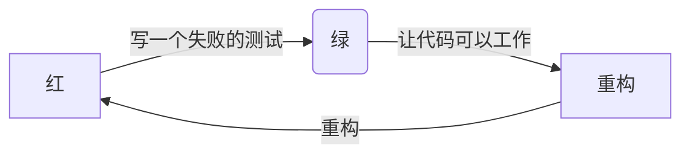

# 框架

## DevOps 框架

### CALMS

- **Culture – 文化：**公司各个角色一起担当业务变化，实现有效协作和沟通；
- **Automation – 自动化：**在价值链中尽量除去手工步骤；
- **Lean – 精益：**运用精益原则更频繁地交付价值；
- **Metrics – 度量：**度量并使用数据来优化交付周期；
- **Sharing – 分享：**分享成功和失败的经验来相互学习。

来自《[实例化 DevOps 原则](https://insights.thoughtworks.cn/instantiate-the-principles-of-devops/)》

### 三步法

- **The First Way：** System Thinking （系统思考：强调全局优化，避免局部优化）；
- **The Second Way：** Amplify Feedback Loops （经过放大的反馈回路：创建从开发过程下游至上游的反馈环）；
- **The Third Way：** Culture of Continual Experimentation And Learning（持续做试验和学习的文化：持续做试验，承担风险、从失败中学习；通过反复实践来达到精通）。

《凤凰项目》中的三步工作法：


扩展资料：《[The Three Ways: The Principles Underpinning DevOps](https://itrevolution.com/the-three-ways-principles-underpinning-devops/)》

#### 三步法实例化

《DevOps 实践指南》 对应的示例：

```tree
 - 三步工作法
   - 流动原则
     - 使工作可见
       - Kanban
         - 电子看板
         - 物理看板
         - 技术债看板
     - 限制在制制品数
     - 减少批量大小
     - 减少交接次数
     - 持续识别和改善约束点
       - 识别系统的约束点
          - 环境搭建
          - 代码部署
          - 测试的准备和执行
          - 紧耦合的架构
       - 决定如何利用这个系统约束点
       - 基于上述决定，考虑全局工作
       - 改善系统的约束点
       - 如果约束点已突破，回到第一点
     - 消除价值流中的困境和浪费
       - 类型
         - 半成品
         - 额外工序
         - 额外功能
         - 任务切换
         - 等待
         - 移动
         - 缺陷
         - 非标准或者手动操作
         - 填坑侠
   - 反馈原则
     - 在复杂系统中安全地工作
       - 管理复杂的工作，从中识别出设计和操作的问题
       - 群策群力解决问题，从而快速地构建新知识
       - 在整个组织中，将区域性的新知识应用到全局范围
       - 领导者要持续培养有以上才能的人
     - 及时发现问题
     - 群策群力，战胜问题获取新知
     - 在源头中保障质量
     - 为下游工作重心而优化
   - 持续学习和实验原则
     - 建立学习型组织和安全文化
     - 将日常工作的改进制度化
     - 将局部发布转化为全局优化
     - 在日常工作中注入弹性模式
     - 领导层强化学习文化
```

### 加速：高效 DevOps 的技术/管理实践

见：《[https://guides.sonatype.com/foundations/devops/principle-based-devops-frameworks/](https://guides.sonatype.com/foundations/devops/principle-based-devops-frameworks/)》

- 技术实践
  - 持续交付
    - 版本控制
    - 部署自动化
    - 持续集成（CI）
    - 基于主干的开发
    - 测试自动化
    - 测试数据管理
    - 安全前移（DevSecOps）
    - 持续交付（CD）
  - 架构
    - 低耦合架构
    - 赋权团队
  - 产品和流程
    - 客户反馈
    - 价值流
    - 以小批量方式工作
    - 团队实验
- 管理实践
  - 精益管理和监控
    - 轻量级变更批准流程
    - 监控
    - 限制在制品数
    - 可视化工作
  - 文化
    - 支持学习
    - 团队内协作
    - 工作满意度
    - 变革型领导

### DevOps 四大支柱

来源：（《Effective DevOps》）

- **协作**。协作是通过支持多人的交互和输入来构建一个特定结果的过程。
- **亲密性**。不仅需要发展和维护个人之间的协作关系，还需要在组织内部、整个行业的团队和部分之间也需要建立紧密的关系。
- **工具**。工具是一个加速器，可以基于当前的文化和方向推动变化。
- **规模化**。规模化强调的是组织在整个生命周期中，所采用的过程和关键点。

### 人、产品、流程和工具

来自《[实例化 DevOps 原则](https://insights.thoughtworks.cn/instantiate-the-principles-of-devops/)》

- 实例化 DevOps 原则
  - 人
    - 领导者身体力行持续改进 高于 关注工具和基础设施
    - 试验并改进流程 而非 指责人的过失
    - 产品思维 高于 项目思维
  - 产品
    - 质量和安全内建 而非 晚期度量和检查
    - 客户反馈 高于 按期交付
    - 基于不可变容器的微服务 高于 单体应用
  - 流程
    - 管理层实践 Improvement Kata 和 Coaching Kata 进行流程持续改进 高于 用结果导向进行管理
    - 全局优化 而非 局部优化
    - 单件流 高于 库存
  - 工具
    - 自动化 高于 手工
    - 基础设施及代码 高于 手工配置
    - 部署流水线 而非 每日构建

## DevOps 生命周期

```process-table
| 需求 | 开发  | 构建  | 测试 | 部署 | 运维 |
|-|-|-|-|-|-|
| 把运维人员作为首要干系人 | 小团队 | 构建工具 | 自动化测试 | 部署工具 | 监控 |
| 在开发需求时寻找他们的意见 | 有限的合作 | 支持持续集成 | 用户验收测试|支持持续部署|对错误情况做出响应 |
| | 单元测试 | | | |
```

效能提升过程：

```process-table
| 度量分析 | 实践固化 | 工程赋能 | 过程打通 |
|-|-|-|-|
```

# 价值驱动

一切从需求出发，再回归到需求

## 做正确的事

我们的诸多软件实践，只是在正确的做事情。取而代之的，我们要去做正确的事情，即**有价值**的。

### 看板原则

看板三原则：

- 可视化
- 限制在制品
- 管理流动

看板的六个实践：

- 可视化
- 限制在制品
- 管理流动
- 显式化流程规则
- 建立反馈环路
- 协作式改进、试验中演进

示例

```kanban
 - 开发看板
   - 待办
   - 分析
   - 待开发
   - 开发
   - 验收
   - 测试
   - 完成
```

应对变化

|          | 待办 | 分析 | 开发 | 测试 | 完成 |
| -------- | ---- | ---- | ---- | ---- | ---- |
|          |      |      |      |      |      |
|          |      |      |      |      |      |
| 紧急工作 |      |      |      |      |      |

### 消除浪费

软件开发的 7 种消费

- 部分完成的工作。
- 多余的特性。『没有比生产过剩更大的浪费』—— 大野耐一
- 重复学习。
- 工作交接。
- 延期。
- 任务切换。上下文切换
- 缺陷。

### 持续改进系统吞吐量

## 实例化需求

### 需求代码化

Jira、Trello 等以特定的数据结果存储在数据库中，那么必然可以从代码中回溯出来。

### 故事原则

Bill Wake 提出了一个好用户故事的验收标准——[INVEST 模型](http://xp123.com/xplor/xp0308/index.shtml)，它由六个单词的首字母组成，分别是

- Independent：每个用户故事应该是独立的，不会和其他用户故事产生耦合
- Negotiable：并不会非常明确的阐述功能，细节应带到开发阶段跟程序员、客户来共同商议
- Valuable：每一个用户故事的交付都要能够给用户带来用户价值
- Estimable：不需要能够准确的估计，但需要能辅助客户排定优先级
- Small：要小一点，但不是越小越好，要大小合适，可以更容易的圈定故事范围
- Testable：需要能够进行验收测试，最好能把 Test Case 提前加进去

### 用户故事

#### 用户故事示例

```gherkin
# language: zh-CN
场景大纲: 用户查看 “我的” 页面未读消息数量提示
  Given 我收到消息
  When 我在“我的”页面
  Then 我可以看到未读消息计数

Note

1. 后端记录用户设备 ID 和用户 ID，记录每种消息的最近查看时间，根据此时间后的消息数量计算未读消息数量；
2. 超过 99 未读显示省略图标；
3. 时间展示规则:
1). 一小时内，显示为 xx 分钟前
2). 小于 24 小时，显示为 xx 小时前
3). 间隔超过 24 小时且小于 48 小时，显示：昨天
4). 间隔超过 48 小时，显示：MM-DD
5). 间隔超过一周：YY-MM-DD （ eg: 2019-03-01）
```

#### 坏的验收标准

1. AC 太多：不超过 5 个
2. 用了很多 AND（没拆分好，偷懒）
3. 穷举每个测试用例
4. 定义实现细节
5. 用了太多只有部分人懂的“术语”
6. 很难理解，不易读

#### 好的验收标准

1. 用场景来拆分故事中的验收标准
2. 使用业务/用户/自然语言/领域特定语言
3. 以“我”出发来描述（同理用户）
4. 触发条件应该是个动作
5. 讲“故事”的方式来安排 AC 的顺序
6. 读起来如同验收测试，业务和用户都看得懂

如何检验验收标准（AC）是否写得足够好？

- 易懂：做到一看就懂了吗？
- 价值：核心用户意图和价值体现出来了吗？
- 逻辑：AC 的拆分、顺序的逻辑是清晰的吗？
- 简洁：做到最简洁了吗？
- 抽象：做到不涉及实现细节吗？
- 验收：能直接作为验收测试用例吗？

## 用户故事地图

> 故事地图是一门在需求拆分过程中保持全景图的技术。

### 故事地图步骤

- 准备工作：通过当前⽤户旅程挖掘用户需求，考虑解决方案
- 1.  基于解决⽅案设计未来⽤户旅程
- 2.  从核心场景出发，头脑⻛暴⽀撑每个⽤户任务的功能需求
- 3.  其他次要场景，头脑⻛暴⽀撑每个⽤户任务的功能需求
- 4.  头脑风暴支撑每个功能需求的支撑性需求

# 转型

## 人

来源：Scott Prugh 《[Continuous Delivery](https://www.scaledagileframework.com/guidance-continuous-delivery/)》

```process-step
 - I 型（专家）
   - 精通某个领域
   - 其它领域的技能或经验很少
   - 很快遇到瓶颈
   - 对下游的浪费和影响不敏感
   - 抵制灵活或者可变的计划
 - T 型（通才）
   - 精通某个领域
   - 拥有很多领域的技能
   - 能突破瓶颈
   - 帮助制订灵活和可变的计划
 - E 型
   - 精通某几个领域
   - 有多个领域的实践经验，执行能力强，能持续创新
   - 潜力无限
```

## 团队变革

## 组织变革

### 组织类型

#### 组织类型学模型

Ron Westrum 组织类型学模型：组织如何处理信息

| 病态型         | 官僚型               | 生机型         |
| -------------- | -------------------- | -------------- |
| 隐瞒信息       | 忽略信息             | 各级探索信息   |
| 消灭信使       | 不重视信使           | 训练信使       |
| 逃避责任       | 各自担责             | 共担责任       |
| 阻碍团队的互动 | 容忍团队的互动       | 鼓励团队间结晶 |
| 隐瞒事故       | 组织是公道和宽容的   | 调查事故根因   |
| 压制新想法     | 认为新想法会造成麻烦 | 接纳新想法     |

—— 《DevOps 实践指南》

### 打造学习文化

在 ThoughtWorks 拥有这么一系列的培训（《[在 ThoughtWorks 我们如何做内部培训？](https://insights.thoughtworks.cn/how-we-do-training-in-thoughtworks/)》

- ThoughtWorks 内部培训
  - ThoughtWorks University，面向毕业生
  - ThoughtWorks Immersion，面向社招
  - Session（分享，一个小时以内）
  - WorkShop（动手），如 OO BootCamp、Ruby BootCamp
  - ThoughtWorks 内训（原郑大晔校）
  - 组内培训
  - 社区

### 康威定律

# 闭环：加快系统流动

> 系统化思维

精益思想五大原则:

- 价值（Value）
- 价值流（Value stream）
- 流动（Flow）
- 拉动（Pull）
- 尽善尽美（Perfection）

## 1. 持续集成

如《Jenkins 权威指南》一书指出，持续集成需要几个不同的阶段

- 阶段一：无构建服务器
- 阶段二：夜间构建
- 阶段三：夜间构建 + 自动化测试
- 阶段四：加入度量指标
- 阶段五：更认真地对待测试
- 阶段六：自动化验收测试和自动化部署
- 阶段七：持续部署

### 自动化构建

好的构建工具应该支持以下的特性

- 依赖管理
- 增量编译
- 正确处理多个模块、应用之间的编译和资源管理任务
- 支持不同的环境配置
- 适应不断变化的产品需求
- 构建自动化

### 持续集成基本纪律

- 构建失败后，不要提交新的功能代码（仅限于修复）
- 提交前，在本地运行所有的提交测试
- 等持续集成测试通过后，再继续工作
- 回家之前，构建必须处于成功状态（CI 红不过夜）
- 时刻准备着回滚到前一个版本（CI Master）
- 在回滚之前，要规定一个修复时间
- 为自己导致的问题负责

### 通知

形式：

- 电子邮件
- RSS 订阅
- 即时消息
- IRC 通知
- 桌面通知
- 短信通知
- 移动通知
- 制造噪声
- 极端反馈设备（如 CI 灯）

### 分支策略

如何选择分支策略：

- 发布节奏。发布频率越高，应该离 master 越近。每天发布 -> 主干开发，每两周可以考虑暂存分支。
- 测试。前置 QA -> master，后置 QA -> release 上进行测试。
- 团队的规模。团队规模越大，离 master 越远；规模越小，基于主干。
- 工作流的适应成本。

#### 按模式划分

##### 2B 模型

2B 型软件，采用多分支是难以避免的：

- 市场/客户驱动定制。如果一切的原则是为了生存下去，那么这一点难以避免。特别是那些生命周期长的行业应用来说，更是如此。
- 销售驱动开发。

常见的情况是，一个十来个人的团队，一年可能要交付至少 20 个项目。更不用说在电信行业中，需要针对于不同的国家或地区进行定制。

##### 2C 模式

2C 型软件，采用主干开发更有优势。

#### 基于功能分支

#### Giflow

#### Pull Request 机制

> Pull Request 是一种通知机制。你修改了他人的代码，将你的修改通知原来的作者，希望他合并你的修改，这就是 Pull Request。

自动地 Code Review

#### 主干开发策略

> 在版本控制的分支模型中，开发人员都在同一个被称为“主干“的分支中进行协作，多个开发人员的代码的汇聚在一起，从而避免创建长时间无法合并分支。因此，这种方式避免了合并地狱，也不会破坏构建，并从此让开发人员过上幸福的生活。

- 代码质量与知识共享
- 协同
- 部署频率和故障平均恢复时间

基本原则：

1. 所有修改都要尽可能出现在主干上。
2. 每个分支都应该在使用后删除。
3. 主干分支的提交都应该保证持续可用。


##### 主干 + PR 机制

开源模式：核心开发人员使用主干，非核心开发人员可以采用 PR 机制。

外包模式：核心开发人员使用主干，非核心开发人员可以采用 PR 机制。

## 2. 自动化

### 自动化演进路径

自动化演进路径（《SRE：Google 运维解密》）：

1. 没有自动化。手动将数据库主进程在多位个位置之间转移。
2. 外部维护的、系统特定的自动化系统。
3. 外部维护的、通用的自动化系统
4. 内部维护的、系统特定的自动化系统
5. 不需要任何的自动化系统

### 自动化部署

#### 平均部署时间

| 公司     | 部署频率    | 部署交付期 | 可靠性 | 客户响应 |
| -------- | ----------- | ---------- | ------ | -------- |
| Amazon   | 23000 次/天 | 分钟       | 高     | 高       |
| Google   | 5500 次/天  | 分钟       | 高     | 高       |
| Netflix  | 500 次/天   | 分钟       | 高     | 高       |
| Facebook | 1 次/天     | 小时       | 高     | 高       |
| Twitter  | 3 次/周     | 高         | 高     |
| 普通企业 | 9 个月/次   | 月或季度   | 低/中  | 低/中    |

—— 《凤凰项目》

### 自动化部署策略

来自《Java 持续交付》中对不同策略的特点及代码总结：

|                      | 单目标部署         | 一次性全部部署     | 最小服务部署                 | 滚动部署                     | 蓝/绿部署            | 金丝雀部署                   |
| -------------------- | ------------------ | ------------------ | ---------------------------- | ---------------------------- | -------------------- | ---------------------------- |
| 整体复杂度           | 低                 | 低                 | 中                           | 中                           | 中                   | 高                           |
| 服务中断             | 是                 | 是                 | 否                           | 否                           | 否                   | 否                           |
| 新旧版本混合         | 否                 | 否                 | 是                           | 是                           | 否                   | 是                           |
| 回滚过程             | 重新部署之前的版本 | 重新部署之前的版本 | 停止更新，重新部署之前的版本 | 停止更新，重新部署之前的版本 | 将流量切回原来的版本 | 停止金丝雀实例               |
| 部署中的基础设施支持 | 健康检查           | 健康检查           | 路由变更、健康检查           | 路由变更、健康检查           | 路由变更、健康检查   | 路由变更、加权路由、健康检查 |
| 监控要求             | 基础               | 基础               | 简单                         | 简单                         | 简单                 | 高级                         |

### 自动化测试

见测试

### 自动化运维

如（《SRE：Google 运维解密》）一书中介绍的『服务可靠度层级模型』：

```pyramid
 - 服务可靠度层级模型
   - 产品设计
   - 软件开发
   - 容量规划
   - 测试 + 发布
   - 事后总结问题根源分析
   - 应急事件处理
   - 监控
```

## 3. 代码化

### 版本化

每个 DevOps 阶段需要版本化的对象（《DevOps 最佳实践》）

| 阶段 | 版本化的对象                          | 工具化                         |
| ---- | ------------------------------------- | ------------------------------ |
| 规划 | 主题、史诗、特性                      | 需求管理工具                   |
| 编码 | S-CI、基线、数据模型                  | 软件管理工具 <br> 数据建模工具 |
| 构建 | 构建 ID                               | 构建服务器工具                 |
| 测试 | 测试数据 、测试用例、测试集、测试运行 | 测试管理 <br> 测试自动化工具   |
| 发布 | 发布说明、部署脚本、配置文件          | 发布工具                       |
| 运维 | 数据文件、协议                        | 数据文件管理工具               |
| 监控 | 监控配置文件                          | 监控系统                       |

### 基础设施即代码

> 基础设施即代码是一种基于从软件开发实践的基础设施自动化的方法。它强调系统及其配置的日常置备和变更具有一致性和可重复性。 —— 《基础设施即代码：云服务器管理》

#### 原则

- 系统能够被复制
- 系统是用完可扔的
- 系统是一致的
- 过程是可重复的
- 设计经常变更

#### 实践

1. 使用定义文件（definition file)
2. 自文档化的系统和流程
3. 一切版本化
   - 可追溯性
   - 回滚
   - 相关性
   - 可见性
   - 可执行性
4. 持续测试系统和流程
5. 小的变更，而不是指变更

### 流水线即代码

> 流水线即代码 (Pipeline as Code) 通过编码而非配置持续集成 / 持续交付 (CI/CD) 运行工具的方式定义部署流水线。

1. 构建步骤脚本化
2. 添加脚本到持续集成
3. 集成自动化验证
4. 分支策略

Jenkinsfile 最佳实践（来源：《[Pipeline Best Practices](https://jenkins.io/doc/book/pipeline/pipeline-best-practices/)》）

1.  确保 Groovy 代码在流水线中只作为胶水。
2.  避免流水线中的 Groovy 代码过于复杂
3.  减少重复相似流水线的步骤
4.  避免调用 `Jenkins.getInstance`

使用共享库：

1.  不要覆写内建的流水线步骤
2.  避免巨大的全局变量声明文件
3.  避免非常大的共享库

示例（来源《[流水线即代码](https://insights.thoughtworks.cn/pipeline-as-code/)》）：

```groovy
node('master') {
   stage('Checkout') {…}
   stage('Code Analysis') {…}
   stage('Unit Test') {…}
   stage('Packing') {…}
   stage('Archive') {…}
   stage('DEV') {…}
}
stage('SIT') {
   timeout(time:4, unit:'HOURS') {
       input "Deploy to SIT?"
   }
   node('master') {…}
}
stage('Acceptance Test') {
   node('slave') {…}
}
```

### Deploy as Code

aka Deployment process as code

- Dockerfile

### 文档代码化

#### 文档代码化

> 文档代码化，将文档以类代码的领域特定语言的方式编写，并借鉴软件开发的方式（如源码管理、部署）进行管理。它可以借助于特定的工具进行编辑、预览、查看，又或者是通过专属的系统部署到服务器上。面向非技术人员的文档代码化的一种常见架构模式是：编辑-发布-开发分离』，

它具备以下一些特征（《[文档代码化](https://www.phodal.com/blog/document-as-code/)》）

- 使用标记语言编写内容。如 markdown
- 可通过版本控制系统进行版本控制。如 git
- 与编程一致的编程体验（除了内容写不了测试）
- 持续部署，即修改完内容可自动发布。
- 与特定的形式组织内容索引。如以知识库的形式来组织内容。
- 特定的文本格式。如架构决策记录、静态内容生成，以用于以提供更好的用户体验
- 可支持 REST API。以通过编辑器来修改内容
- 可以支持多种方式的输出。如网站标准 HTML，又或者是 Docx、Latex 等
- 支持编辑、校对工作流
- 支持搜索
- 多人协作

#### 如何设计一个文档代码化系统？

1. 使用格式化的文档
2. 借助静态站点生成技术来发布系统
3. 通过定制标记语言扩充能力
4. 面向非技术人员实现编辑器

常见的实践有：

- [ADR](https://www.phodal.com/blog/documenting-architecture-decisions/)（Architecture Decision Records，即架构决策记录）。是一个类似于亚历山大模式（即：设计模式）的短文本文件。（虽然决策本身不一定是模式，但它们分享着力量的特征平衡。）每个记录都描述了一组力量和一个响应这些力量的决策。请注意，决策是这里的核心部分，所以特定的力量可能出现在多个 ADR（架构决策记录） 中。

对应的系统实践：

- 《[【架构拾集】基于 Markdown 文档展示系统设计](https://www.phodal.com/blog/architecture-in-realworld-markdown-based-document-system-design/)》
- [Ledge](https://github.com/phodal/ledge/)

#### 架构文档化

```quadrant
 - 选择架构描述方法
   - 正式
     - 能不到这里就不到
   - 徒劳
     - 回避这里
   - 社区
     - 演进到这里
   - 部落
     - 从这里开始

config: {"left": "易于分享", "right": "难以分享", "bottom": "难以变更", "top": "易于变更"}
```

## 4. 实例化需求

> 实例化需求是一组方法，它以一种对开发开发团队有所帮助的方式（理想情况下表现为可执行的测试）描述计算机系统的功能和行为，让不懂技术的利益相关者也可以理解，即使客户的需求在不断变化，它也具有很好的可维护性，可以保持需求的相关性。 从而帮助团队交付正确的软件产品。

### 实例化需求过程

1. 从目标中获取范围
2. 从协作中制定需求说明
3. 举例说明
4. 提炼需求说明
5. 频繁验证
6. 演化出一个文档系统

### 实例化需求步骤

1. 澄清价值

- 描述背景
- 理清目标/问题

2. 识别操作及操作步骤

- 列用户操作
- 画出工作流

3. 定义业务规则

- 列举规则

### 验收测试驱动开发

来源：《[验收测试驱动开发介绍（ATDD）](https://www.jianshu.com/p/0389360ac58f)》

- 讨论澄清阶段
  - 全组参与的针对需求和方案的讨论
  - 大家产出对需求和方案共同的理解
  - 通过明确验收测试方式澄清我们的实现方案
  - 验收测试方式将被自动化
- 开发阶段
- 用明确具体的验收测试方式来指导开发工作
- 验收测试的自动化和特性的开发可以并行开展
- 全组成员对验收测试的自动化负责，而不仅仅是测试人员
- 最终，我们的产品实现能让所有的自动化测试通过
- 交付阶段
- 我们要保证之前迭代所有的自动化验收测试能在新交付上通过
- 给所有利益相关者演示我们的新特性
- 收集反馈，讨论改进

# 反馈：建立快速反馈

or 强化反馈环

## 1. 测试

### 测试驱动开发

> TDD 是测试驱动开发（Test-Driven Development）的英文简称，是敏捷开发中的一项核心实践和技术，也是一种设计方法论。TDD 的原理是在开发功能代码之前，先编写测试用例代码，通过测试代码确定编写什么产品代码。



#### TDD 三定律

- **定律一** 在编写不能通过的单元测试前，不可编写生产代码
- **定律二** 只可编写刚好无法通过的单元测试，不能编译也算不通过
- **定律三** 只可编写刚好足以通过当前失败测试的生产代码

#### 测试驱动循环

1. 每个特性都从一个验收测试开始
2. 分离测量进度的测试和捕捉回归的错误的测试
3. 从最简单的成功场景开始测试
4. 编写您愿意读的测试
5. 看着测试失败
6. 从输入开发到输出开发
7. 针对行为进行单元测试，而非针对方法
8. 聆听测试
9. 调整循环

—— 《测试驱动的面向对象软件开发》

#### 实例化需求

#### Tasking？

### 整洁的测试

#### FIRST 原则

如 Robert C. Martin 在《代码整洁之道》所说的那样，好的测试应该是：

- 快速（Fast），测试应该够快。
- 独立（Indendent），测试应该相互独立。
- 可重复（Repeatable），测试应当可在任何环境中通过。
- 自足验证（Self-Validating），测试应该有布尔值输出。
- 及时（Timely），测试应该及时编写。

要我说的话，它应该还有：

- **同一人编写**，测试应该由开发业务代码的编写。这样他/他们才知道自己代码写得烂。
- **边界**，测试直接不影响业务代码。这里指的主要是 private -> public 的行为，又或者是业务代码中包含测试代码，而非因为测试对原有代码重构。
- **有效命名**。测试信息应该体现在方法名上，表达某一个特定的需求。

测试代码应该遵循生产代码的质量标准。

## 2. 代码回顾

来源：《深入核心的敏捷开发》

```mindmap
 - 代码回顾（CodeReview)
   - 目的：学习 vs 挑错
   - 重点
     - 代码 vs 作者
     - 习惯 vs bug
     - 模式 vs 反模式
   - 注意
     - 整洁代码 vs 我的写法
     - 整洁代码 vs 重新设计
   - 形式
     - 随机摄取代码（当天编写的）
     - 每日一次，每次半小时以内，每次回顾 200~300 行代码
```

PS：时间视真实的团队而定，如果不能每天进行代码回顾，时间一般控制在 0.5 ~ 1 小时内。

### 寻找什么？

基于：[Java Code Review Checklist](https://dzone.com/articles/java-code-review-checklist) 和 《Java 持续交付》

#### 理解性问题

包含以下几点

- 使用解决方案或者问题域的名称
- 使用含义显而易见的名称
- 尽量减少类和成员的可访问性
- 尽量减少局部变量的作用域
- 在单个逻辑组件（包、服务或者服务）中，要遵循『不要重复自己（DRY）』的原则
- 用代码来解释代码
- 使用异常而不是难懂的错误代码，并且不返回 null

#### 语言规范问题

- 对可恢复条件使用已检查问题，对编程错误使用运行时异常
- 检查参数的有效性，使其尽可能接近规范要求或者用户输入
- 标明哪些参数可以为 null
- 在公共类中，尽量使用访问器方法，而非公共字段
- 通过接口来引用对象
- 使用枚举来替换 int 常量
- 使用标记接口（marker interface）来定义类型
- 同步对共享可变数据的访问
- 优先使用 executors 来执行任务和线程
- 将线程安全记录到文档中

#### 安全性问题

- 应该检查输入数据的大小和范围，始终保证提供给数据存储、中间件或第三方系统的任何输入数据都是安全的。
- 不要在日志中记录高度敏感的信息
- 不要在异常中保留敏感信息（如，文件路径、系统内部逻辑、配置信息等）
- 考虑在使用后从内存中清除高度敏感的数据。
- 遵循最小权限原则
- 将其他与案例相关的信息记录到文档中

#### 性能问题

- 注意低效的算法（如多层循环）
- 避免创建不必要的对象
- 注意字符串连接的性能损失
- 避免过度使用同步，并保持同步代码块范围尽可能小
- 注意算法中潜在的死锁或活锁
- 确保正确配置了线程池和缓存

### 基本实践

基本过程：

```process-table
| 回顾 | 概述 | 检视 | 总结 |
|-|-|-|-|
| 回顾上次提到的问题及解决情况 | 简述本次检视的代码内容 | 逐行代码进行检视，讨论和记录问题 | 复述发现的问题和结论，做好记录 |
```

实践：

- 寻找一个适合多人回顾的显示器
- 线下集中优先，远程次之
- 制定回顾时间，及对应的回顾组织者（定期更换）
- 先讲述用户故事（业务视角），再讲述实现视角
- 当天代码，当天回顾
- 未提交的代码不回顾（除非遇到问题）
- 并非所有的代码都要回顾（根据需要）
- 回顾时，随时记录修改的内容
- 下次回顾时，需要检视上次的修改部分
- 意见不统一时（小问题以规范为主），可以再次讨论（或是会议）
- 功能过大时，可以考虑以小型 session / 专题的形式讲述

回顾的方式：

- 由提交者，讲述编写的代码
- 由其他/她人讲述提交者编写的代码

不能按时回顾时：

- 改天，并拿出更多的时间
- 积累过多未回顾代码时，Tech Lead 应当检视其他/她人写的代码

### 代码审查自动化

#### PMD

#### Checkstyle

#### Findbugs

## 3. 小步前进

> 小步前进是一系列步骤的集合，其目的是：集成越早问题越小。

### 小步提交

1. 一次本地提交只做一件事情
2. 一次远程提交只做一个用户故事
3. 频繁进行本地提交

### Git Hooks

Git 钩子列表：

```bash
applypatch-msg     post-merge         pre-auto-gc        prepare-commit-msg
commit-msg         post-receive       pre-commit         push-to-checkout
post-applypatch    post-rewrite       pre-push           update
post-checkout      post-update        pre-rebase
post-commit        pre-applypatch     pre-receive
```

Commit Hook 示例：

```process-table
| 执行提交脚本 | 执行 pre-commit  | 执行 Checkstyle| 执行预置的 lint | 提交代码 |
|-|-|-|-|-|
| git-cz | husky | checkstyle | lint-staged | git commit |
| conventional-changelog| commitlint | prettier  | | |
| |  | | | |
```

Push Hook 示例：

```process-table
| git push | 执行 prePush | 执行 lint | 执行 testing | 提交 |
|-|-|-|-|-|
```

提交信息规范（《[如何写好一个 Git 提交信息及几种不同的规范](https://www.phodal.com/blog/how-to-write-a-better-git-commit-message/)》）：

- **build**: 影响构建系统或外部依赖关系的更改（示例范围：gulp，broccoli，npm）
- **ci**: 更改我们的持续集成文件和脚本（示例范围：Travis，Circle，BrowserStack，SauceLabs）
- **docs**: 仅文档更改
- **feat**: 一个新功能
- **fix**: 修复错误
- **perf**: 改进性能的代码更改
- **refactor**: 代码更改，既不修复错误也不添加功能
- **style**: 不影响代码含义的变化（空白，格式化，缺少分号等）
- **test**: 添加缺失测试或更正现有测试

## 4. 高频率发布

## 5. 可视化

### 监控

### 监控分层模型

出自《DevOps 最佳实践》一书：

```mindmap
 - 监控分层模型
     - 系统监控
       - 服务监控
          - 基础设施服务
          - 应用程序服务
       - 资源监控
          - CPU
          - 内存
          - 带宽
          - ……
       - 内建监控
          - 应用中的监控机制
       - 事件监控
          - 基础设施组件事件
          - 基础设施服务事件
          - 应用程序事件
     - 应用程序监控
       - 应用程序接口监控
          - 健康度？
       - 基础设施服务监控
     - 信息系统监控
       - 信息系统 E2E 监控
       - 基础设施 E2E 监控
       - 基础设施域监控
     - 链路监控
       - 信息流 E2E 监控
       - 业务流程 E2E 监控
       - 终端用户 E2E 监控
```

### Dashborad

Dashing: http://dashing.io/

# 持续：持续创新文化

如 RedHat 官方在 [DevOps 文件](https://www.redhat.com/zh/topics/devops) 所讲述：

> DevOps 十分依赖重视开放性和透明度的协作文化。实施 DevOps 就等于应用开源原则和实践，因为 DevOps 的文化价值观与开源社区和敏捷性工作方法的价值观紧密交融。

or 持续实验文化

## 持续学习

### 技术打磨

#### 练习入门

出自《[演进：在工作的前三年里快速成长（练习篇）](https://www.phodal.com/blog/evolution-how-to-practise/)》

#### 练习的进阶

诀窍（《[练习技术的诀窍](https://www.phodal.com/blog/how-to-make-practise-works/)》

- 可持续性：寻求量变
  - 让自己保持稳定的作息
  - 稳定的输出
  - 有充分的练习内容
- 可度量
  - SMART
- 可视化：产生仪式感
- 小步前进
- 里程碑：成就感

建议:

- 从模仿开始
- 时间限制的练习
- 日常积累灵感
- 用专业的工具

#### 高产

> 精通 one，学习 another，关注 next。 —— justjavac

高产策略（《[如何高产](https://www.phodal.com/blog/how-to-be-high-performance/)》

- 制定时间、目标和产出策略
  - 长期目标，一个小目标
  - 时间投入收益比对
  - 知识沉淀：输出优于输入
  - 不造轮子，再造轮子
  - 技能图谱：寻找、练习、升华
- 练习所需要的技能
- 寻找合适的工具，并打磨工具和手艺
- 练习速度、质量
- 通过休息来提出产出

## 持续交付

> 持续交付是一组实践规范和指导原则，能够让软件交付团队在短时间内产生有价值的、稳定的软件。

持续部署的发布工程哲学：

- 自服务模型
- 追求速度
- 密闭性
- 强调策略和流程

### 核心的构建管道

——《Java 持续交付》

```process-step
 - 开发机器
   - 所有的测试可以在本地运行
   - 提交代码
 - Git 服务器
 - 持续集成服务器
   - 代码质量（Sonar）分析
   - 上传制品仓库（Nexus）
   - 单元测试
   - 集成测试
   - 容错测试
   - 功能测试/压力测试编排
   - 开发编码
 - QA 环境
   - 验收测试
   - 性能测试
   - 探索性测试（API 和 UI）
   - 验收和性能测试（Cucumber 和 JMeter）
   - 功能和压力测试
   - -> 中心化日志
 - 预发布环境
   - 冒烟测试
   - 压力测试
   - 指标监控
   - -> 中心化日志
 - 生产环境
   - 冒烟测试
   - 主动监控和报警
 - 反馈
   - 是否验证了原始的设想？
   - 如何改进业务架构？
   - 如何提升运维能力？
```

## 追求卓越

### 测试即文档

『单元测试是可执行的文档』

## 优化

### 童子军规则

童子军有一条规则：“永远保持离开时的露营地比你发现它时更整洁”。

> 提交的代码要比检出的更好

#### 避免破窗效应

> 破窗效应：及时矫正和补救正在发生的问题。

以一幢有少许破窗的建筑为例，如果那些窗不被修理好，可能将会有破坏者破坏更多的窗户。最终他们甚至会闯入建筑内，如果发现无人居住，也许就在那里定居或者纵火。又或想像一条人行道有些许纸屑，如果无人清理，不久后就会有更多垃圾，最终人们会视若理所当然地将垃圾顺手丢弃在地上。因此破窗理论强调着力打击轻微罪行有助减少更严重罪案，应该以“零容忍”的态度面对罪案。

此理论描述了社区失序的五个阶段：

1. 社区开始出现失序的情形，部分居民迁出社区。
2. 未能迁离社区的居民因担心自身安全，对区内的事务漠不关心。
3. 地区的监察力下降，社区的治安进一步恶化。
4. 区内更多的居民迁走，仍然留在区内的居民则更加退缩，减少外出时间。
5. 外来的犯罪份子入侵社区，令犯罪数字持续上升。

对应的软件开发失序：

1. 少部分开发人员不关注代码质量。如测试的编写
2. 开发人员关注于交付速度，不关心代码质量。
3. 项目代码质量进一度恶化
4. 改一个 bug，出现更多的 bug
5. 项目无法维护，只能重写

### 技术债务管理

技术债治理的四条原则（《[技术债治理的四条原则](https://insights.thoughtworks.cn/managing-technical-debt/)》）：

1. 核心领域优于其他子域
2. 可演进性优于可维护性
3. 明确清晰的责任定义优于松散无序的任务分配
4. 主动预防优于被动响应

# 闭环

## 回到故事的开始

## 新项目检查清单

对于一个新项目来说，我们可以从下述的四个维度来检查项目的准备情况：

- Process，关注于从权限管理、获取代码、部署上线、代码集成等的流程。
- People，连接利益相关者、第三方合作伙伴（组织外）、协作团队（组织内）、团队成员等相关的人。
- Tech，包含了技术远景、文档（文档即代码）、项目代码、技术栈、软件库管理等。
- Business，涵盖了业务远景、业务需求、跨功能需求等业务相关功能的需求。

详见：[New Project Checklist](https://phodal.github.io/new-project-checklist/)

## 构建可信的软件系统

来源：[构建可信软件系统](https://github.com/phodal/trusted)

1. 可信的软件安全策略
2. 高度自动化的工作流
3. 设计架构适应度
4. 完善工具与基础设施
5. 高效的测试策略
6. 更好的知识传递
7. 框架与模块的与时俱进
8. 边界限定的系统架构
9. 持续偿还的技术债务
10. 强有力的个人 & 愿意改进的团队
