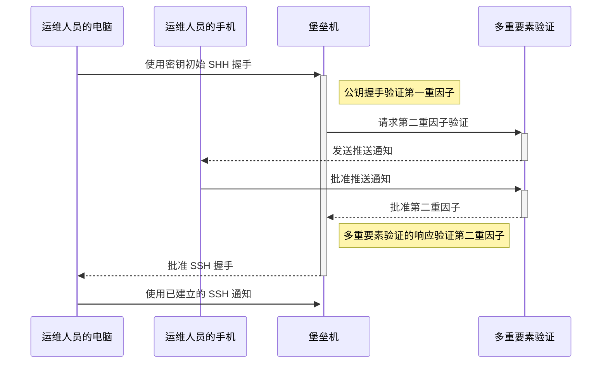

# DevSecOps 实践

# Web 应用安全

# 云基础设施安全

## 账号安全

### 安全入口

```mermaid
sequenceDiagram
    participant 运维人员的电脑
    participant 运维人员的手机
    participant 堡垒机
    participant 多重要素验证

    运维人员的电脑->>+堡垒机: 使用密钥初始 SHH 握手
    Note right of 堡垒机: 公钥握手验证第一重因子
    堡垒机->>+多重要素验证: 请求第二重因子验证
    多重要素验证-->>-运维人员的手机: 发送推送通知
    运维人员的手机->>+多重要素验证: 批准推送通知
    多重要素验证-->>-堡垒机: 批准第二重因子
    Note right of 堡垒机: 多重要素验证的响应验证第二重因子
    堡垒机-->>-运维人员的电脑: 批准 SSH 握手
    运维人员的电脑->>+堡垒机: 使用已建立的 SSH 通知
```
