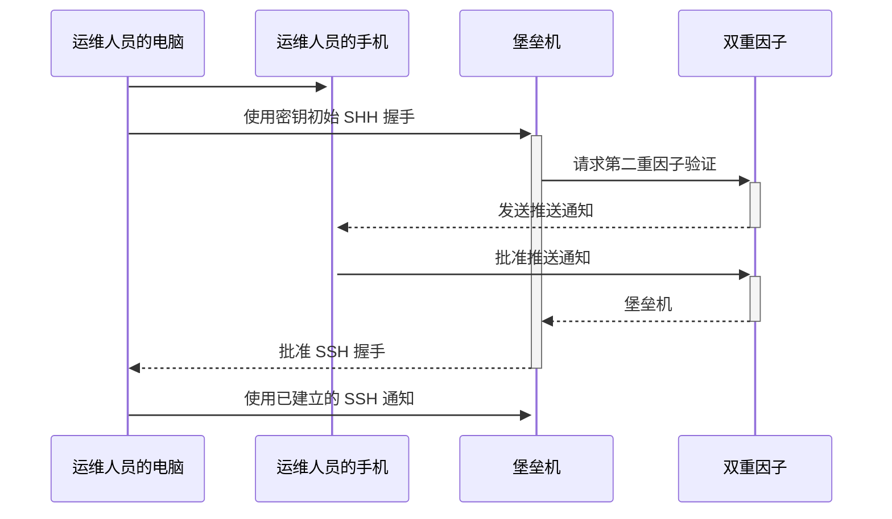

# DevSecOps 实践

```mermaid
sequenceDiagram
    运维人员的电脑->>+运维人员的手机:
    运维人员的电脑->>+堡垒机: 使用密钥初始 SHH 握手
    堡垒机->>+双重因子: 请求第二重因子验证
    双重因子-->>-运维人员的手机: 发送推送通知
    运维人员的手机->>+双重因子: 批准推送通知
    双重因子-->>-堡垒机: 堡垒机
    堡垒机-->>-运维人员的电脑: 批准 SSH 握手
    运维人员的电脑->>+堡垒机: 使用已建立的 SSH 通知
```
