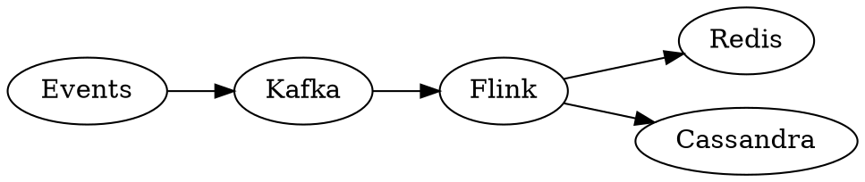
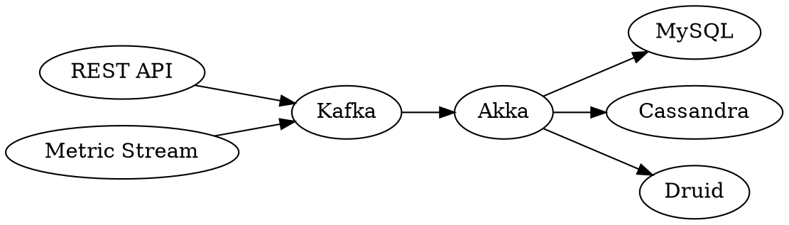

# 度量

# 评估与度量

## DevOps 四个关键指标

```mindmap
 - 提升交付效能
   - 部署频率
     - 批量的大小
     - 自动化程度
     - 测试效率
     - 部署效率
     - 构建效率
     - ……
   - 交付前置时间
     - 需求稳定性
     - 任务交接
     - 等待时间
     - 团队速度
     - 返工率
     - ……
   - 平均恢复时间
      - 监测的效率
      - 系统可配置性
      - 系统可维护性
      - 日志可用性
      - 架构质量
      - ……
   - 变更失败率
      - 自动化程度
      - 架构质量
      - 基础设施即代码
      - 测试质量
      - 测试代码质量
      - 代码质量
        - 编码规范
        - 重复代码
        - 测试覆盖率
        - 扇入扇出度
        - 圈复杂度
        - ……

```

## 成熟度评估表格模型

| 产品/项目 | 维度     | 指标项       | 指标解读                                   | 单位 | 数据采集方式 | 值  |
| --------- | -------- | ------------ | ------------------------------------------ | ---- | ------------ | --- |
|           | 交付效率 | 交付前置时间 | 需求前置时间：从需求提出，到上线的时间周期 | 天   | 自动/手动    | 1.5 |

```
| 产品/项目 | 维度 | 指标项 | 指标解读 | 单位 | 数据采集方式| 值 |
|-|-|-|-|-|-|-|
| | 交付效率 | 交付前置时间 | 需求前置时间：从需求提出，到上线的时间周期 | 天| 自动/手动 | 1.5 |
```

## 度量维度

- 需求管理：平均需求交付时长
- 开发管理：单元测试覆盖率、平均修复问题时间、问题打回率、代码注释率、代码质量
- 构建管理：构建频率、平均构建时间、构建成功率
- 部署管理：部署频率、平均部署时间、部署成功率
- 进度管理：任务燃尽数

## 常见低效原因

如我司同事说：《[DevOps —— 实施 DevOps 应该考虑的若干问题](https://blog.csdn.net/gudufeiyang/article/details/104190250)》

- **技术债务**：长期以来，开发团队只注重新功能的开发，不注意重构和流程改进，不注重新技术、新方法的运用。
- **团队协作和流程**：传统的方式，开发团队和运维团队的工作是分离的。他们有不同考核和业务目标；工作过程中的协作方式基本依靠流程或电子流。
- **系统架构不合理**：耦合度高，导致开发过程中的问题和领域不能被合理的分割，部署和运维过程也可能会导致整个系统崩溃。
- **研发方法和流程不科学**：研发过程不够敏捷，或者敏捷过程中的重要实践并未正确的执行。
- **人员技能偏低**：人员技能不足，无法支撑项目的架构设计、疑难技术的攻坚，无法满足业务的运维要求。
- **团队文化**：没有形成良好的学习文化，在面对问题时指责、惩罚是重要手段，无法让所有成员坦诚的分析问题，无法从失败中学习技术和经验。

## 度量标准

### 可用性度量

可用性度量公式：

> 网站可用性百分比 = （该期间的总秒数 - 系统宕机的秒数） / 该期间的总秒数

| 可用性 %             | 每年的故障时间 | 每月的故障时间 | 每周的故障时间 | 每天的故障时间 |
| -------------------- | -------------- | -------------- | -------------- | -------------- |
| 55.5555555% (9 个 5) | 162.33 天      | 13.53 天       | 74.92 小时     | 10.67 小时     |
| 90% (1 个 9)         | 36.53 天       | 73.05 小时     | 16.80 小时     | 2.40 小时      |
| 95% (1.5 个 9)       | 18.26 天       | 36.53 小时     | 8.40 小时      | 1.20 小时      |
| 97%                  | 10.96 天       | 21.92 小时     | 5.04 小时      | 43.20 分钟     |
| 98%                  | 7.31 天        | 14.61 小时     | 3.36 小时      | 28.80 分钟     |
| 99% (2 个 9)         | 3.65 天        | 7.31 小时      | 1.68 小时      | 14.40 分钟     |
| 99.5% (2.5 个 9)     | 1.83 天        | 3.65 小时      | 50.40 分钟     | 7.20 分钟      |
| 99.8%                | 17.53 小时     | 87.66 分钟     | 20.16 分钟     | 2.88 分钟      |
| 99.9% (3 个 9)       | 8.77 小时      | 43.83 分钟     | 10.08 分钟     | 1.44 分钟      |
| 99.95% (3.5 个 9)    | 4.38 小时      | 21.92 分钟     | 5.04 分钟      | 43.20 秒       |
| 99.99% (4 个 9)      | 52.60 分钟     | 4.38 分钟      | 1.01 分钟      | 8.64 秒        |
| 99.995% (4.5 个 9)   | 26.30 分钟     | 2.19 分钟      | 30.24 秒       | 4.32 秒        |
| 99.999% (5 个 9)     | 5.26 分钟      | 26.30 秒       | 6.05 秒        | 864.00 毫秒    |
| 99.9999% (6 个 9)    | 31.56 秒       | 2.63 秒        | 604.80 毫秒    | 86.40 毫秒     |
| 99.99999% (7 个 9)   | 3.16 秒        | 262.98 毫秒    | 60.48 毫秒     | 8.64 毫秒      |
| 99.999999% (8 个 9)  | 315.58 毫秒    | 26.30 毫秒     | 6.05 毫秒      | 864.00 微秒    |
| 99.9999999% (9 个 9) | 31.56 毫秒     | 2.63 毫秒      | 604.80 微秒    | 86.40 微秒     |

### 自动化测试度量指标

- 自动化测试用例数。
- 自动化测试覆盖率。
- 自动化测试通过率。
- 自动化测试执行时长。
- 自动化测试执行频率。

### 质量属性

Lionheart 项目的场景属性场景：

| 质量属性 | 场景                                                              | 优先级 |
| -------- | ----------------------------------------------------------------- | ------ |
| 可用性   | 招标数据库无响应时，系统应记录错误日志，并在 3 秒内用历史数据代替 | 高     |
| 可用性   | 用户搜索公开的招标文件，一年中 99% 的时间都能正常获取结果列表     | 高     |
| 可伸缩性 | 可以在计划维护窗口（7 小时）内添加新服务器                        | 低     |
| 性能     | 当系统处于每秒 2 次搜索的平均负载时，用户可在 5 秒内看搜索结果    | 高     |
| 可靠性   | 招标文件更新应该在变更后 24 小时内反映出来                        | 低     |
| 可用性   | 用户触发的更新（如收藏招标文件）应在 5 秒内反映在系统中           | 低     |
| 可用性   | 系统可以处理每秒 10 次搜索的峰值负载，平均响应时间下降不超过 10%  | 低     |
| 可伸缩性 | 预设数据增长率为每年 5%，系统应该能轻松应付                       | 低     |

—— 《架构师修炼之道》

# 监控

不同级别的栈的监控目的

| 监控目标           | 数据来源       |
| ------------------ | -------------- |
| 发现检测           | 应用和基础设施 |
| 性能降低检测       | 应用和基础设施 |
| 容量规划           | 应用和基础设施 |
| 针对业务的用户反应 | 应用           |
| 入侵检测           | 应用和基础设施 |

# APM

> APM 即应用性能管理，主要指对企业的关键业务应用进行监测、优化，提高企业应用的可靠性和质量，保证用户得到良好的服务，降低 IT 总拥有成本(TCO)。

## Apdex

> Apdex 全称是 Application Performance Index，是由 Apdex 联盟开放的用于评估应用性能的工业标准。Apdex 联盟起源于 2004 年，由 Peter Sevcik 发起。Apdex 标准从用户的角度出发，将对应用响应时间的表现，转为用户对于应用性能的可量化为范围为 0-1 的满意度评价。

Apdex 定义了应用响应时间的最优门槛为 **T**，另外根据应用响应时间结合 T 定义了三种不同的性能表现：

- **Satisfied（满意）**：应用响应时间低于或等于 T（T 由性能评估人员根据预期性能要求确定），比如 T 为 1.5s，则一个耗时 1s 的响应结果则可以认为是 satisfied 的。
- **Tolerating（可容忍）**：应用响应时间大于 T，但同时小于或等于 4T。假设应用设定的 T 值为 1s，则 4 \* 1 = 4 秒极为应用响应时间的容忍上限。
- **Frustrated（烦躁期）**：应用响应时间大于 4T。

| Apdex 值           | 颜色 | 说明                                                   |
| ------------------ | ---- | ------------------------------------------------------ |
| 0.75 ≤ Apdex ≤ 1   | 绿色 | 表示应用、实例或事务被调用时响应很快，用户体验较满意。 |
| 0.3 ≤ Apdex < 0.75 | 黄色 | 表示应用、实例或事务被调用时响应较慢，用户体验一般。   |
| 0 ≤ Apdex < 0.3    | 红色 | 表示应用、实例或事务被调用时响应极慢，用户体验较差。   |

## 开源 APM

- [PinPoint](https://github.com/naver/pinpoint) 韩国开源的一个功能完备的 APM 系统，支持 JVM 性能数据采集、服务 Trace、告警等功能。它具有应用程序无侵入的应用特性。
- [ZipKin](https://zipkin.io/) 是 Twitter 开源的 Trace 工具，通过 Java 程序中引入客户端，可隐式拦截 Http、Thrift 等形式服务调用。
- [SkyWalking](https://skywalking.apache.org/zh/) 是一个开源 APM 系统，为微服务架构和云原生架构系统设计。它通过探针自动收集所需的指标，并进行分布式追踪。
- [Prometheus](https://prometheus.io/) 是一个开源的系统监控和报警工具。
- [CAT](https://github.com/dianping/cat) 是基于 Java 开发的实时应用监控平台，为美团点评提供了全面的实时监控告警服务。
- [Hawkular](https://www.hawkular.org/) 一个功能完备的 APM 系统，应用程序中嵌入 Hawkular 客户端，主动将采集数据通过 Http 或者 Kafka 传递给 Hawkular。

# 异常管理

## 异常分类

- 规划
  - 针对于所有的主题（Themes 大故事）和史诗故事（Epics）
  - 确认错误路径
  - 复用鱼骨图（石川图）找到导致错误路径的根本原因
  - 完成健康模型
- 编码
  - 针对每个特性
  - 识别额外的错误路径，识别根本原因（鱼骨分析）和完成健康模型
  - 完成事态分类
  - 构建单元测试用例来检测将要写入的事态
  - 创建包含异常处理的源代码
  - 在源代码中添加需要补充的事态，并调整鱼骨分析、健康模型和异常文件
  - 编写脚本来改变监控您的预设
- 构建
  - 编译源代码到目标代码，同时为错误路径运行单元测试用例
  - 确保所有的事态能够被单元测试覆盖
- 测试
  - 为错误路径运行涵盖监控预设的系统测试和系统集成测试
  - 确保所有事态能够被系统测试和系统集成测试命中
- 发布
  - 确保健康模型、事态分类和异常文件覆盖率
- 部署
  - 部署目标码、更新监控规则的脚本来更改监控的预设
- 运维
  - 当提供的解决方案无效时，向开发人员反馈
- 监控
  - 当事态没有被正确检测到时，向开发人员反馈
  - 当没有预见到的事态发生时，请开发人员调整鱼骨分析、健康模型和异常文件

# 监控

## 告警系统

各类告警架构对比（来源：[https://www.ituring.com.cn/article/497377](https://www.ituring.com.cn/article/497377)）

| 方案                         | 简述                                                                                | 实时流式计划（单条） | 分布式 | 状态管理（中间数据等） | 延迟   | 语言支持                       | Hadoop 整合  | 执行方式  |
| ---------------------------- | ----------------------------------------------------------------------------------- | -------------------- | ------ | ---------------------- | ------ | ------------------------------ | ------------ | --------- |
| 现有方案（Akka + Cassandra） | 状态依赖于外部存储（Cassandra 不一定抗得住）                                        | 支持                 | 不支持 | 不支持，依赖外部存储   | 不好说 | Java                           | 没有整合     |           |
| 现有方案改造（Akka + Redis   | 状态依赖于外部存储（Redis）衍生出其它不可能的单点故障，而且开发工作量和难度大       | 支持                 | 支持   | 不支持，依赖外部存储   | 不好说 | Java                           | 没有整合     |           |
| Spark Streaming              | Spark Streaming 哪里都好，就是不支持真正意义上的流式计划（单条）                    | 不支持（小批量）     | 支持   | 有状态（RDD）          | 秒级   | Java, Scala, Python            | 整合得比较好 | Stage     |
| Storm                        | Storm 为流式计算而生，但是无法满足我们需要状态管理的场景，需要引入 外部存储。另外？ | 支持                 | 支持   | 无状态                 | 毫秒级 | Ruby, Python, Perl, JavaScript | 整合一级     |           |
| Flink                        | 流计算方面综合了上面两者的优点，且基于 pipeline 模式要优于 Spark 的 Stage 模式      | 支持                 | 支持   | 有状态，自己管理内容   | 毫秒级 | Java, Scala, Python            | 整合非常好   | Pipelined |

### OneAPM 架构

CEP 1.0：



CEP 2：

解析计算引擎 -> 处理队列引擎 -> 分布式管理平台 -> 操作接口

SQL DSL -> Antlr -> AST Tree -> Process Model -> Event Process Result



# 分析

# 大数据处理

```process-table
| 数据源 | 数据集成 | 数据存储 | 数据分析 | 数据可视化 |
|-|-|-|-|-|
| 结构化数据 | 数据收集 | 对象存储 | 机器学习 | 报表 |
| 非结化数据 | 数据清理 | 文件存储 | 深度学习 | 图表 |
|          | 数据清理 | 数据库   |        | 仪表盘 |
|          | 数据处理 |         |        |       |
```

## 大数据工具

```process-step
 - 数据源
    - CSV
    - TXT
    - 音频、视频
    - 图片
    - 数据库
 - 数据集成
    - Spark
    - Flink
    - NiFi
    - Kafka
    - RabitMQ
    - Pentaho
 - 数据存储
    - HDFS
    - MINIO
    - Neo4j
    - PostgreSQL
    - MongoDB
    - MariaDB
    - Hbase
 - 数据分析
    - Scikit Learn
    - Keras
    - Numpy + Pandas
    - Tensorflow
 - 数据可视化
    - Dashing
    - D3.js
    - Leaflet
    - Echarts
```

## 数据-价值金字塔

```pyramid
 - 数据-价值金字塔
  - 驱动，价值，影响 <br> 更改，变化，交付：行动、
  - 整理，推荐，理解，推断，学习：预测
  - 结构，链接，元数据，标签，探索，交互，分享：报表
  - 清洗，聚合，可视化，问题：图表
  - 收集，展示，披露单条数据记录：数据记录
```

——《敏捷数据科学》

- **数据记录**。整个栈中对原子数据记录的处理和展示
- **图表**。从数据记录中提出数据的不同属性进行汇总，并把它们绘制成图表
- **执行**。从数据中提取关系和趋势，让我们能创建互动式图表进行数据探索
- **预测**。使用金字塔结构进行推断、预测和推荐
- **先去**。指引用户行为去创造和获取价值

## 敏捷大数据处理

```process-table
| 事件日志 | 采集器 | 海量存储 | 批量处理 | 分布式文件仓库 | 应用服务器 | 浏览器 |
|-|-|-|-|-|-|-|
```

- 事件日志。每个事件记录了在某个时间、什么环境下发生了什么事情。
- 采集器。负责事件的聚合。
- 海量存储。是一个能支持多个进程并行访问的文件系统。
- 分布式文件仓库。是用文档格式存储数据的结点集群。
- Web 应用服务器。能以最小开销将数据转换为 JSON，以便于客户端可视化。
- 浏览器。

示例：

```process-table
| 事件日志 | 采集器 | 海量存储 | 批量处理 | 分布式文件仓库 | 应用服务器 | 浏览器 |
|-|-|-|-|-|-|-|
| | Python -> AVRO 格式 |  MongoDB / ElasticSearch  |  Pig / Wonderdog | MongoDB / ElasticSearch | Flask |> Boostrap + D3.js / Echarts / NVD3.js |
```

# 数据可视化

## 可视化流程

```process-table
| 获取 | 分析 | 过滤 | 挖掘 | 表述 | 修饰 | 交互 |
|-|-|-|-|-|-|-|
```

## 数据展示形式

参见：[https://visual.phodal.com/](https://visual.phodal.com/)

# 数据驱动设计

# 安全

# 安全模型

## 分析：STRIDE 模型

| 威胁                               | 定义             | 对应的安全属性 |
| ---------------------------------- | ---------------- | -------------- |
| Spoofing（伪装）                   | 冒充他人身份     | 认证           |
| Tampering（篡改）                  | 修改数据或代码   | 完整性         |
| Repudiation（抵赖）                | 否认做过的事     | 不可抵赖性     |
| Information Disclosure（信息泄露） | 机密信息泄露     | 机密性         |
| Denial of Service（拒绝服务）      | 拒绝服务         | 可用性         |
| Elevation of Privilege（提升权限） | 未经授权获得许可 | 授权           |

## 度量：DREAD 模型

来源：《[STRIDE 模型和 DREAD 模型](https://ixyzero.com/blog/archives/745.html)》

| 等级             | 高（3）                                        | 中（2）                                    | 低（1）                |
| ---------------- | ---------------------------------------------- | ------------------------------------------ | ---------------------- |
| Damage Potential | 获取完全验证权限，执行管理员操作，非法上传文件 | 泄露敏感信息                               | 泄露其他信息           |
| Reproducibility  | 攻击者可以随意再次攻击                         | 攻击者可以重复攻击，但有时间限制           | 攻击者很难重复攻击过程 |
| Exploitability   | 初学者短期能掌握攻击方法                       | 熟练的攻击者才能完成这次攻击               | 漏洞利用条件非常苛刻   |
| Affected users   | 所有用户，默认配置，关键用户                   | 部分用户，非默认配置                       | 极少数用户，匿名用户   |
| Discoverability  | 漏洞很显眼，攻击条件很容易获得                 | 在私有区域，部分人能看到，需要深入挖掘漏洞 | 发现漏洞极其困难       |

# 实践

## 软件安全保障

## 定义 SSA

策略一：

1. 评估软件和制订修复计划
2. 定义数据的各种安全风险并进行分类，优先修复最严重的风险
3. 执行全面的代码检查
4. 进行必要的更改
5. 测试修复并在生产环境中验证它们确实是有效的
6. 制定防御机制来保护应用程序的访问及其管理的数据
7. 衡量你所做的这些更改的有效性
8. 以适当的方式培训管理者、用户和开发人员，以确保良好的应用安全性

策略二：

1. 把安全性要求置于产品需求之上（新应用开发时）
2. 定义并与开发人员沟通写代码时必须遵守的安全编码规范
3. 开发人员在写新代码时必须遵守的安全编码规范
4. 完成应用开发之后，要执行全面的代码检查
5. 对整个应用程序进行渗透测试和脆弱性评估
6. 评估测试结果以找到安全和业务之间的平衡点。
7. 执行所有需要进行的安全性修复
8. 重复步骤（5）

## OWASP

### Top 10 风险

来源：[https://owasp.org/www-project-top-ten/](https://owasp.org/www-project-top-ten/)

版本：2017

- 注入
- 失效的身份认证
- 敏感信息泄露
- XML 外部实体(XXE)
- 失效的访问控制
- 安全配置错误
- 跨站脚本(XSS)
- 不安全的反序列化
- 使用含有已知漏洞的组件
- 不足的日志记录和监控

# 微架构

# 后端：微服务

## 微服务要素

### 12 要素

[12-Factor App](https://12factor.net/zh_cn/) 为构建如下的 SaaS 应用提供了方法论：

- 使用**标准化**流程自动配置，从而使新的开发者花费最少的学习成本加入这个项目。
- 和操作系统之间尽可能的**划清界限**，在各个系统中提供**最大的可移植性**。
- 适合**部署**在现代的**云计算平台**，从而在服务器和系统管理方面节省资源。
- 将开发环境和生产环境的**差异降至最低**，并使用**持续交付**实施敏捷开发。
- 可以在工具、架构和开发流程不发生明显变化的前提下实现**扩展**。

1. **基准代码** 。一份基准代码，多份部署
2. **依赖** 。显式声明依赖关系
3. **配置** 。在环境中存储配置
4. **后端服务** 。把后端服务当作附加资源
5. **构建，发布，运行** 。严格分离构建和运行
6. **进程** 。以一个或多个无状态进程运行应用
7. **端口绑定** 。通过端口绑定提供服务
8. **并发** 。通过进程模型进行扩展
9. **易处理** 。快速启动和优雅终止可最大化健壮性
10. **开发环境与线上环境等价** 。尽可能的保持开发，预发布，线上环境相同
11. **日志** 。把日志当作事件流
12. **管理进程** 。后台管理任务当作一次性进程运行

## 领域驱动设计

# 前端：微前端

# APP：基座化

# 分布式团队

TBD

# 远程工具

## 工具选型

[How to do effective video calls](https://martinfowler.com/articles/effective-video-calls.html)

### 工具示例

# 离岸交付

# 工具

# 选择工具

## BDD 工具选型

> Behavior Driven Development，行为驱动开发是一种敏捷软件开发的技术，它鼓励软件项目中的开发者、QA 和非技术人员或商业参与者之间的协作。

《[BDD 框架对比: Cucumber.js vs Robot Framework vs Gauge.js](https://github.com/phodal/bdd-frameworks-compare)》

考虑到情况有：

- 团队水平
- 语言因素。持续学习文化
- 文档丰富度

# 制造工具

```process-table
| 个人实践 | 记录流程 | 形成统一语言 | 抽象原则与模式 | 标准化流程（工具） |
|-|-|-|-|-|
```
