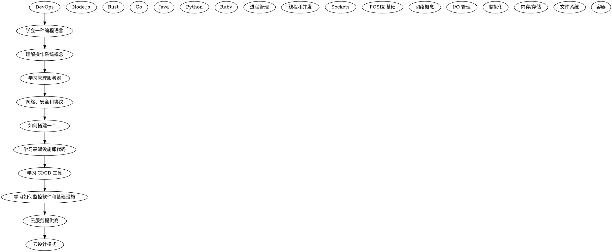

```graphviz
digraph {
 subgraph start {
   DevOps;
 }
 subgraph language {
   "学会一种编程语言"
   "Node.js"
   "Rust"
   "Go"
   "Java"
   "Python"
   "Ruby"
 }
 subgraph os {
    "理解操作系统概念";
    "进程管理"
    "线程和并发"
    "Sockets"
    "POSIX 基础"
    "网络概念"
    "I/O 管理"
    "虚拟化"
    "内存/存储"
    "文件系统"
 }
 subgraph server {
    "学习管理服务器"
 }
 subgraph networks {
    "网络、安全和协议"
 }
 subgraph how_to {
    "如何搭建一个__"
 }
 subgraph infra_code {
    "学习基础设施即代码"

    subgraph containers {
       "容器"
    }
 }
 subgraph cicd {
    "学习 CI/CD 工具"
 }
 subgraph monitor {
    "学习如何监控软件和基础设施"
 }
 subgraph cloud {
    "云服务提供商"
 }
 subgraph patterns {
    "云设计模式"
 }
 DevOps -> "学会一种编程语言" [ltail=start, lhead=language];
 "学会一种编程语言" -> "理解操作系统概念" [ltail=language, lhead=os];
 "理解操作系统概念" -> "学习管理服务器" [ltail=os, lhead=server];
 "学习管理服务器" -> "网络、安全和协议" [ltail=server, lhead=networks];
 "网络、安全和协议" -> "如何搭建一个__" [ltail=networks, lhead=how_to];
 "如何搭建一个__" -> "学习基础设施即代码" [ltail=how_to, lhead=infra_code];
 "学习基础设施即代码" -> "学习 CI/CD 工具" [ltail=infra_code, lhead=cicd];
 "学习 CI/CD 工具" -> "学习如何监控软件和基础设施" [ltail=cicd, lhead=monitor];
 "学习如何监控软件和基础设施" -> "云服务提供商" [ltail=monitor, lhead=cloud];
 "云服务提供商" -> "云设计模式" [ltail=cloud, lhead=patterns];
}
```
